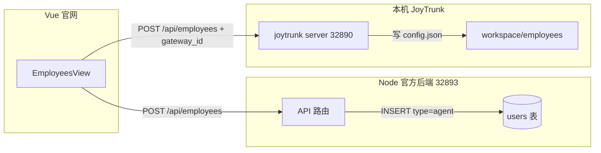

# 创建 Agent 并同步 IM 用户与本地 Agent 方案

## 问题与根因

- **404 原因**：Vue 使用 [vite.config.js](vue/vite.config.js) 将 `/api` 代理到 `http://localhost:32893`，即 **nodejs 官方后端**。而 [nodejs/server.js](nodejs/server.js) 仅挂载了 `/api/auth`、`/api/users`、`/api/im`，**没有** `/api/employees` 和 `/api/teams/current`，因此这两个接口返回 404。
- **需求**：创建 agent 时要同时完成两件事——(1) **后端**：创建一名 IM 用户（type=agent，带 gateway_id），以便 agent 能通过 WebSocket 参与 IM；(2) **本地**：通过 CLI/joytrunk server 在 workspace 下创建员工目录与 config，使本地 gateway 能运行该 agent。

## 架构关系（简要）

- **后端（nodejs）**：负责账号与 IM 身份（users 表已有 `type IN ('user','official','agent')`、`gateway_id`）。
- **本地（cli/joytrunk/server）**：负责员工目录、config.json、A2A 与 gateway 运行；不负责 IM 用户创建。

## 实现方案

### 1. Nodejs：支持「agent 归属」并实现 employees / teams 接口

- **数据模型**：在 `users` 表增加 `**owner_uid`**（BIGINT NULLable，仅 type=agent 时使用），表示该 agent 的拥有者**用户的 uid**（即拥有者在 users 表中的 `uid`，不是自增 id）。迁移在 [nodejs/db/pg.js](nodejs/db/pg.js) 的 `runMigrations` 中加 `ALTER TABLE users ADD COLUMN owner_uid BIGINT`（若不存在）。
- **创建 IM 用户（agent）**：在 nodejs 中新增 `POST /api/employees`（需 auth）：
  - **路由**：挂载到 [nodejs/server.js](nodejs/server.js)，如 `app.use('/api/employees', authMiddleware, employeesRoutes)`；在 employees 路由中实现 `POST /`（或于 controller 中实现 `createEmployee`）。
  - **逻辑**：先查当前用户 uid（`SELECT uid FROM users WHERE id = req.ownerId`），再调用 [nodejs/services/createUser.js](nodejs/services/createUser.js) 的 `createUserWithGatewayId`，传入 `{ type: 'agent', name, owner_uid: 当前用户uid, uid: generateUid() }`（persona/role/specialty 可存扩展字段或 JSON 列，若无则先只存 name；phone/email 可为空）。
  - **响应**：返回 201 及 `{ id, uid, gateway_id, name, ... }`，供前端写入本地 agent 的 config 或传给本地 server。
- **列表与当前团队**：
  - `GET /api/employees`（auth）：先取当前用户 uid（`SELECT uid FROM users WHERE id = req.ownerId`），再 `SELECT * FROM users WHERE type='agent' AND owner_uid = 当前用户uid AND deleted_at IS NULL`，返回数组。
  - `GET /api/teams/current`（auth）：返回当前用户信息（含 uid）+ 其名下 agents（同上，按 owner_uid = 当前用户 uid），与 CLI server 的 [GET /api/teams/current](cli/joytrunk/server/server.js) 语义对齐（`{ owner, employees }`）。
- **删除（补偿用）**：`DELETE /api/employees/:id`（auth）：校验该 agent 的 `**owner_uid = 当前用户 uid`**，然后软删（`UPDATE users SET deleted_at = NOW() WHERE id = :id`），用于创建流程中「第二步本地创建失败」时的回滚。
- **其他**：`GET /api/employees/:id`、`PATCH /api/employees/:id` 按需实现（校验 **owner_uid = 当前用户 uid**），至少保证列表与创建、删除可用。

### 2. 前端：双源调用（先后端再本地）

- **环境变量**：在 Vue 中增加可选 `VITE_JOYTRUNK_SERVER`（例如 `http://127.0.0.1:32890`），表示本机 joytrunk server 地址；未配置时仅调后端。
- **创建流程（含原子性：补偿事务）**（[vue/src/views/EmployeesView.vue](vue/src/views/EmployeesView.vue)）：
  1. 调用**当前 API base**（即 nodejs）`POST /api/employees`，body：`{ name, persona, role, specialty }`；返回 `{ id, uid, gateway_id, name, ... }`。
  2. 若配置了 `VITE_JOYTRUNK_SERVER`，再请求该 base 的 `POST /api/employees`，body：`{ name, persona, role, specialty, gateway_id, backend_user_id: id }`，用于在本地创建 agent 并写入 gateway_id。
  3. **若步骤 2 失败**：立即调用 nodejs `DELETE /api/employees/:id`（步骤 1 返回的 id），做补偿回滚，避免留下「仅有 IM 用户、无本地 agent」的脏数据；并向用户提示创建失败及原因。
  4. 若未配置本地 server，则仅完成步骤 1，并在 UI 上提示「已在 IM 中创建该 agent，请在本机启动 JoyTrunk 并同步或手动创建员工并绑定 gateway_id」。
- **列表与团队**：`GET /api/employees`、`GET /api/teams/current` 已由 nodejs 提供，继续走当前 proxy（32893）即可。

### 3. CLI Server：支持带 gateway_id 创建员工

- 在 [cli/joytrunk/server/lib/store.js](cli/joytrunk/server/lib/store.js) 的 `createEmployee(ownerId, payload)` 中，允许 payload 带 `gateway_id`（及可选 `backend_user_id`），并写入员工 `config.json`（与现有 id、ownerId、name、persona 等一致）。
- [cli/joytrunk/server/server.js](cli/joytrunk/server/server.js) 的 `POST /api/employees` 无需改路径，只需把 `req.body` 中的 `gateway_id` 透传给 store；若前端在「仅本地」场景下不传 gateway_id，则保持兼容。

### 4. 可选：前端 API 封装

- 在 [vue/src/api.js](vue/src/api.js) 中可增加 `api.localEmployees` 或通过 `getBase()` 的另一种 base（如 `VITE_JOYTRUNK_SERVER`）封装「本地 server 的 POST /api/employees」，供 EmployeesView 在创建时第二步调用；或直接在组件内根据 `import.meta.env.VITE_JOYTRUNK_SERVER` 发第二次请求，保持实现简单即可。

---

## 一、Node.js 后端：风险与约束

- **数据校验（库层）**：在迁移中为 `owner_uid` 增加约束，保证**仅 type=agent 时允许非空**。例如 `ADD CONSTRAINT chk_owner_uid_only_for_agent CHECK ((type = 'agent') OR (owner_uid IS NULL))`，即非 agent 类型用户不得设置 owner_uid；可选再用 trigger 在 UPDATE 时当 `type != 'agent'` 将 owner_uid 置为 NULL。
- **事务原子性**：创建 agent 时，将「查当前用户 uid + createUserWithGatewayId（INSERT users 含 gateway_id）」放在同一数据库事务中（如 `pool.query('BEGIN')` … `COMMIT` / `ROLLBACK`），避免部分成功部分失败产生脏数据。若 createUserWithGatewayId 内部已单条 INSERT，则至少保证该 INSERT 与后续业务在同一事务中。
- **接口权限**：`GET /api/employees/:id`、`PATCH /api/employees/:id`、`DELETE /api/employees/:id` 必须**先按 id 查出记录，再校验 `type='agent' AND owner_uid = 当前用户 uid`**，不满足则 404 或 403，防止越权访问/修改他人 agent。
- **软删安全**：DELETE 接口除校验 `owner_uid = 当前用户 uid` 外，**必须校验 `type='agent'`**，仅允许删除 agent 类型用户，避免误删普通用户（若 id 被误传）。
- **字段兼容**：persona/role/specialty 若写入 users 表，需在迁移中**先增加对应列**（如 `ALTER TABLE users ADD COLUMN persona TEXT` 等，若不存在）；或统一存入扩展 JSONB 列（如 `meta JSONB`），避免 INSERT 时因缺列报错。

---

## 二、前端：风险与约束

- **网络异常与回滚风险**：调用本地 CLI 时若「请求已发但未收到响应」（超时、断网），**不可盲目执行后端 DELETE 回滚**，否则可能造成「本地已创建、后端已删除」的反向脏数据。处理方式：① 本地 POST 使用较短超时（如 8s），超时视为失败再回滚；② 或先 GET 本地 employees 列表，若已存在同 gateway_id 的 agent 则视为成功、不回滚；③ 回滚前可选：再请求一次本地 GET 确认无该 gateway_id 再执行 DELETE。
- **环境变量校验**：使用前校验 `VITE_JOYTRUNK_SERVER` 格式：需包含 `http://` 或 `https://`，主机与端口合法（如 `/^https?:\\/\\/[^/]+$/`），非法则提示配置错误或降级为「仅后端创建」。
- **补偿场景完整**：除「本地创建失败→回滚」外，明确「后端创建成功、本地请求超时」策略：超时后执行有限次重试（如 1～2 次），仍失败再回滚；并在 UI 提示「本地同步超时，已回滚；请检查本机 JoyTrunk 服务后重试」。
- **错误分类提示**：区分并展示：**后端创建失败**（如 4xx/5xx）、**本地创建失败**（网络/超时/4xx）、**回滚失败**（DELETE 失败，提示「请到后台删除未绑定的 agent」），便于用户定位问题。
- **跨域**：前端直连本地 CLI（如 32890）时，CLI 需配置 CORS 允许前端源（如 `Access-Control-Allow-Origin` 或 cors 中间件）；或在文档/部署说明中写明「开发时通过代理访问本地 CLI 避免跨域」。

---

## 三、CLI Server：风险与约束

- **旧 config 兼容**：读取员工 config 时，`gateway_id`、`backend_user_id` 按可选字段处理，缺失时为 `undefined`，不假定必存在，避免旧版 config.json 解析报错。
- **gateway_id 唯一性**：创建/更新员工前，若 payload 带 `gateway_id`，先查本 workspace 内是否已有其他员工使用该 gateway_id；若已存在则返回 409 或覆盖策略由产品决定（如禁止重复绑定）。
- **透传白名单**：不将 `req.body` 全量透传，仅允许白名单字段写入 config（如 `name, persona, role, specialty, gateway_id, backend_user_id`），其余忽略，防止恶意字段破坏 config.json 结构。
- **幂等**：同一 `backend_user_id` 或 `gateway_id` 再次 POST 创建时，先查是否已存在对应员工；若存在则**更新**该员工 config（或返回 200 已有），避免重复创建多个相同绑定的 agent。

---

## 四、整体流程：风险与约束

- **uid 生成**：明确 `generateUid()` 为雪花算法或全局唯一方案（如 [nodejs/utils/snowflake.js](nodejs/utils/snowflake.js)），保证跨实例唯一，避免多 agent 共用同一 uid 破坏 owner_uid 关联。
- **接口语义一致**：后端返回的 `id`（backend 用户主键）作为 `backend_user_id` 传给 CLI 时，类型约定为**数字**（或统一字符串）；CLI 存储与比较时类型一致，避免隐式转换错误。
- **重试**：后端创建或本地创建失败时，对**非 4xx** 的临时错误（如 5xx、网络超时）支持有限重试（如最多 2 次），再失败再回滚，减少因短暂波动导致的失败。
- **日志**：关键步骤打结构化日志（如「创建 agent 开始/成功/失败」「回滚请求/成功/失败」「本地同步请求/成功/超时」），便于线上排查与追溯。

---

## 数据流小结

| 步骤    | 调用方 | 接口                                                | 作用                                                          |
| ----- | --- | ------------------------------------------------- | ----------------------------------------------------------- |
| 1     | Vue | POST /api/employees（nodejs 32893）                 | 在 users 表创建 type=agent、**owner_uid=当前用户 uid**、生成 gateway_id |
| 2     | Vue | POST /api/employees（本地 32890，若配置）                 | 在 workspace/employees 下创建目录与 config.json，写入 gateway_id      |
| 2 失败时 | Vue | DELETE /api/employees/:id（nodejs）                 | 补偿回滚：软删刚创建的 IM 用户，保证两步一致                                    |
| 列表    | Vue | GET /api/employees、GET /api/teams/current（nodejs） | 展示当前用户下的 agents（按 **owner_uid**）                            |

## 验收要点

- 使用官网 Vue（proxy 到 32893）时，POST /api/employees 不再 404，且返回 201 及 gateway_id。
- GET /api/teams/current 与 GET /api/employees 返回当前用户及其 agents。
- 配置了本地 joytrunk server 后，创建 agent 会同时在本机生成员工目录与 config，且 config 中含 gateway_id，便于后续 gateway 用该 agent 身份连 IM。

## 涉及文件

- **Nodejs**：[nodejs/db/pg.js](nodejs/db/pg.js)（迁移 **owner_uid**）、新建 nodejs/routes/employees.js 与 nodejs/controllers/employeesController.js（实现 POST/GET/DELETE 等，**按 owner_uid 归属**）、[nodejs/server.js](nodejs/server.js)（挂载 /api/employees、/api/teams/current，含 **DELETE /api/employees/:id** 用于补偿）。
- **Vue**：[vue/src/views/EmployeesView.vue](vue/src/views/EmployeesView.vue)（双步创建+补偿）、[vue/src/api.js](vue/src/api.js)（可选封装本地 employees）、[vue/.env.example](vue/.env.example) 或文档中说明 `VITE_JOYTRUNK_SERVER`。
- **CLI**：[cli/joytrunk/server/lib/store.js](cli/joytrunk/server/lib/store.js)（createEmployee 支持 gateway_id 并写入 config）。

