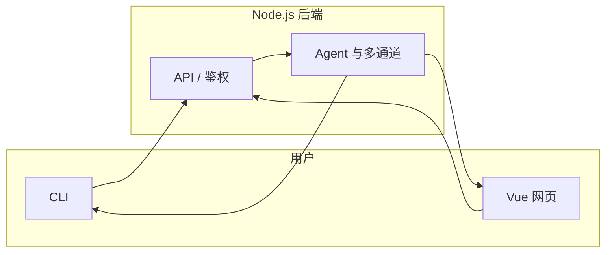
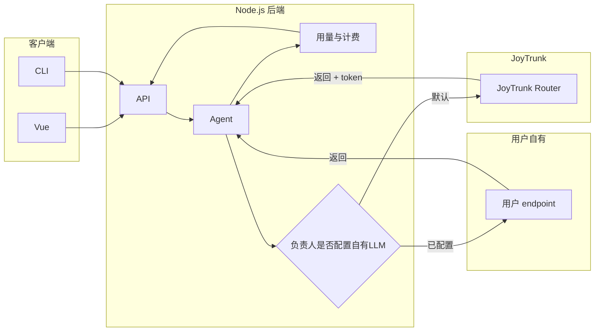

# JoyTrunk（喜象 Agent）— Agent 蓝图

> **给 Agent 的说明**：在着手任何开发或修改前，请先阅读本文档的「Agent 协作标注」区，了解当前是否有其他 agent 正在相关工作，避免重复劳动与冲突。工作期间请主动在该区更新你的任务与状态，离开或完成后及时更新，便于其他 agent 接手。实现或修改功能时，**按最高效方式做好测试**（可先写测试再实现，也可先实现再补测）；**完成前**须运行测试并确保全部通过。用户环境为 **Windows**，终端默认 **PowerShell**；给出或执行终端命令、脚本时，**使用 PowerShell 语法**，勿默认使用 Linux/bash 语法。

---

## 1. 项目概述

- **项目名**：JoyTrunk，中文名 **喜象 Agent**。产品定义见 [product.md](product.md)。
- **一句话**：JoyTrunk 是一款部署在用户本地的、7×24 小时运行的智能体员工；负责人通过即时通讯与员工交互完成日常工作，支持多员工、员工生存法则与可选社交能力。
- **目标用户**：不熟悉 AI 技术但希望使用智能体的用户，开箱即用、无需复杂配置。
- **运行平台**：JoyTrunk **支持 Linux 与 Windows 双平台**；cli 与本地 gateway 可在两种系统上安装运行，配置与 workspace 路径按平台解析（见 §4.2）。
- **安装与发布**：用户可通过 **`pip install joytrunk`** 安装；安装后获得 `joytrunk` 命令行入口。使用 **`joytrunk onboard`** 初始化本地配置与工作区、配置员工；本地网页管理在 **http://localhost:32890**（默认端口 32890），用于管理员工、团队与设置。

---

## 2. 技术栈与架构

JoyTrunk 是**独立产品**，由 **cli/**、**vue/**、**nodejs/** 三个目录完整实现，**不依赖、不包含** nanobot 作为运行时代码。nanobot 仅作**学习与模仿对象**，目标是在架构与体验上超越 nanobot。JoyTrunk **支持 Linux 与 Windows**；cli 与本地 gateway 在两平台上均可运行。JoyTrunk 以 **PyPI 包** 形式发布，包名 **`joytrunk`**，支持 `pip install joytrunk`（Linux / Windows）。**CLI 入口** 由该 Python 包提供（`joytrunk`、`joytrunk onboard` 等）；本地管理界面（Vue + 后端 API）需能由该包**启动并监听 32890 端口**（例如通过 `joytrunk serve`、`joytrunk gateway` 或在 onboard 时提示启动）。

上述流程：用户安装 → onboard 初始化 → 在 32890 端口进行网页管理。

- **cli/**：以 `joytrunk` 为入口命令，`joytrunk onboard` 初始化配置与工作区；作为「CLI 渠道」与员工对话；可选 `joytrunk gateway`、`joytrunk status`。
- **vue/**：Vue 前端，JoyTrunk 自有即时通讯客户端 + 管理后台（创建/管理员工、绑定渠道等），对接 nodejs。
- **nodejs/**：后端，账号与注册、负责人/员工/团队 CRUD、agent 与多通道实现、会话与路由。

### 大模型接入：默认 JoyTrunk Router，支持用户可选配置自有 LLM

- **默认**：未配置自有 LLM 时，大模型请求由后端转发至 **JoyTrunk Router**（JoyTrunk 自营大模型路由服务），用户无需配置任何 API Key；Router 返回 completion 及 token 数，后端做用量存储与计费。
- **可选**：负责人可在设置中配置自有大模型（API Key、Base URL、模型名）；配置后该负责人的 agent 请求由后端直连用户提供的 endpoint，不经过 JoyTrunk Router，不产生 JoyTrunk 计费；可选统计 token 仅用于前端展示。
- **计费**：仅对经 JoyTrunk Router 的用量计费；自有 LLM 用量不计费。

---

## 3. cli / vue / nodejs 功能细化（满足产品需求）

以下按 [product.md](product.md) 的需求对三端功能细化，便于按模块分工实现。本节表格中「product §X」指 product.md 的节号。

### 3.1 CLI（本地命令行，兼作一种 IM 渠道）

| 产品需求来源 | 功能细化 |
| --- | --- |
| 安装与注册、开箱即用（product §6、product §1） | 提供 `joytrunk` 入口命令；`joytrunk onboard` 初始化本地配置与工作区（如 `~/.joytrunk`），创建/刷新配置文件、工作区目录、模板，交互简洁、无需复杂配置。 |
| 作为即时通讯渠道之一（product §5） | 作为「CLI 渠道」：用户通过终端与指定员工对话，下达任务、接收结果；需与 nodejs 后端或本地 gateway 通信，支持选择当前负责人、当前员工、会话。 |
| 后台运行与待命（product §6） | 可选子命令：`joytrunk gateway` 启动本地常驻服务（与 nodejs 或本地 agent 协同），使员工 7×24 待命；`joytrunk status` 查看运行状态、已绑定渠道、当前员工列表等。 |
| 配置与多端一致 | 配置与工作区路径、schema 与 nodejs 约定一致（如 `~/.joytrunk/config.json`、`~/.joytrunk/workspace`），便于 vue 或 nodejs 共用同一套配置。 |

### 3.2 Vue（前端网页：JoyTrunk 自有 IM + 管理后台）

| 产品需求来源 | 功能细化 |
| --- | --- |
| 安装与注册、扫码注册（product §6） | 注册/登录页：支持扫码注册 JoyTrunk 账号（对接 nodejs 认证）；登录后进入主界面；设置中可补充其他登录与联系方式。 |
| 自有即时通讯（product §5） | 即时通讯客户端：会话列表、与某位员工的对话界面、发送消息、接收员工回复（富文本/文件等）；支持多员工切换，即「与 JoyTrunk 团队联系」的默认方式之一。 |
| 创建员工并成为负责人、多员工（product §2、§6、§7） | 管理后台：创建 JoyTrunk 员工（名称、人格、职责、专长等），创建即绑定为当前用户为负责人；员工列表、编辑/停用员工；团队视图：负责人 + 多名员工形成 JoyTrunk 团队。 |
| 多员工与人格分化（product §4） | 员工配置 UI：为人格、职责、专长、业务模块、工作重心等设值；不同员工不同配置，像管理真人员工一样管理智能体团队。 |
| 绑定多种交互方式（product §5） | 设置/渠道管理：绑定或解绑第三方渠道（飞书、QQ、Telegram 等），查看 CLI 是否已连接；可选展示「默认通过微信小程序与 App」的入口（若后续有小程序/App）。 |
| 观察与试用他人员工（product §3） | （可选，MVP 后可做）浏览其他负责人的公开员工、试用体验，便于选择或设计自己的团队。 |
| **用量与收费** | 默认展示「当前使用 JoyTrunk 智能体服务」与用量/计费入口；提供「使用自己的大模型（可选）」配置（API Key、Base URL、模型），保存后走自有 LLM，提供「恢复默认使用 JoyTrunk」；用量页区分 Router 计费用量与自有 LLM 用量（仅展示、注明不计费）；预付费展示余额/充值/扣费记录，后付费展示本期用量与账单。 |

### 3.3 Node.js（后端：账号、团队模型、agent 与多通道）

| 产品需求来源 | 功能细化 |
| --- | --- |
| 账号与注册（product §6） | 用户注册、登录、会话管理；扫码登录、微信小程序/App 登录等 API（可选）；鉴权与权限（仅负责人可管理自己的员工与团队）。 |
| 负责人与员工神圣纽带、团队构成（product §2、§7） | 数据模型与 API：负责人（owner）、员工（employee）、团队（team = 一名负责人 + 多名员工）；员工归属唯一负责人，不可转移；CRUD：创建/编辑/停用员工，查询团队与员工列表。 |
| 多员工与人格分化（product §4） | 员工实体字段：人格、职责、专长、业务模块、工作重心等；可为每名员工配置不同系统提示词或策略，以体现「不同人格与专长」。 |
| 个人隐私与社交能力（product §4） | 员工「个人」属性与隐私边界：偏好、风格、隐私策略（如哪些信息可对非负责人用户暴露）；与负责人以外用户社交时的行为策略与数据隔离（仅脱敏后帮助他人）。 |
| 即时通讯接入、每员工为独立智能体（product §4、§5） | 多通道接入：JoyTrunk 自有（WebSocket/HTTP，与 vue 或移动端通信）、飞书、QQ、Telegram、CLI（与 cli 或本地 gateway 通信）；每个员工对应独立 agent 实例或会话；消息路由：负责人 ↔ 某员工、员工 ↔ 外部用户（社交）。 |
| 员工生存法则（product §8、§9） | 在系统提示词、策略引擎、路由策略中固化：不得向任何非负责人泄露负责人宿主机工作状态或敏感信息（截屏、文件内容、运行环境等）；仅可在个人隐私脱敏前提下帮助他人；所有员工行为均受该约束。 |
| 后台运行、7×24 待命（product §6） | 常驻服务：接收各通道消息，按「负责人-员工-会话」路由到对应 agent，执行任务后回写结果到对应通道；支持与 cli 的 `joytrunk gateway` 或本地 agent 进程协同（由架构选型决定）。 |
| 成功标准（product §8） | 稳定接收负责人指令、完成任务、通过即时通讯正确返回结果；负责人-员工关系模型在 API 与返回数据中一致体现（神圣纽带、利益共同体、团队组成）。 |
| **JoyTrunk Router 与自有 LLM 双模式** | 按负责人（owner_id）判断是否已配置自有 LLM；未配置则请求发往 JoyTrunk Router（带鉴权），解析 token 落库并计费；已配置则直连用户 endpoint（API Key/base URL/model 后端安全存储），解析 token 可选落库仅展示、不计费。用量表含 source（router/custom）、仅 source=router 计费。提供用量/余额/账单查询 API 与自有 LLM 配置 CRUD（敏感字段脱敏）。 |

### 3.4 MVP 优先级建议（对应 product §7）

- **nodejs**：账号与登录、负责人/员工/团队 CRUD、单通道（如先做 JoyTrunk 自有 IM 或 CLI）消息收发与 agent 调度、员工生存法则注入。
- **vue**：注册/登录、自有 IM 对话界面、创建并绑定至少一名员工、基础员工配置（人格/职责）。
- **cli**：`joytrunk onboard`、`joytrunk` 作为 CLI 渠道与员工对话，可选 `joytrunk gateway` 与 `joytrunk status`。

---

## 4. 关键路径与约定

### 4.1 入口命令

- **入口命令**：`joytrunk` 由 **pip 安装的 Python 包** 提供（在 cli 项目中实现，通过 `pyproject.toml` 等 entry_points 注册）。
- **子命令**：`joytrunk onboard`（初始化配置与工作区，可引导用户打开本地管理页）、可选 `joytrunk agent`、`joytrunk gateway`、`joytrunk status` 等。启动本地服务的子命令（如 `joytrunk serve` 或 `joytrunk gateway`）默认绑定 **localhost:32890**，用于提供网页管理界面与 API。

### 4.2 配置与工作区路径

- **根路径**：JoyTrunk 本地根（单机通常对应一名负责人）。在 **Linux/macOS** 下为 `~/.joytrunk`，在 **Windows** 下为 `%USERPROFILE%\.joytrunk`（PowerShell 中即 `$env:USERPROFILE\.joytrunk`）。实现时使用**平台无关**方式解析用户主目录（如 Node 的 `os.homedir()`、Python 的 `Path.home()`），避免写死 `~` 或反斜杠。
- **配置文件**：`~/.joytrunk/config.json`（通用写法）；Windows 下等价于 `%USERPROFILE%\.joytrunk\config.json`。schema 在 JoyTrunk 代码库内定义，cli 与 nodejs 统一约定。
- **workspace 根**：`~/.joytrunk/workspace` 为该负责人的工作区根目录；Windows 下等价于 `%USERPROFILE%\.joytrunk\workspace`。

### 4.3 多员工下的 ~/.joytrunk/workspace 设定

一名负责人可拥有多名员工，每名员工有独立人格、记忆与技能。workspace 需支持**多员工隔离**，同时保留负责人级共享配置与可选共享资源。以下路径在 **Linux 与 Windows** 上含义相同；实现时使用路径拼接库（如 Node 的 `path.join`）以保证两平台路径分隔符正确。

- **多员工子目录**：`~/.joytrunk/workspace/employees/<employee_id>/`
  - `<employee_id>` 与 nodejs 后端员工 ID 一致（如 UUID），由 nodejs 分配，cli/vue 通过配置或 API 获取。
- **每员工子目录内建议包含**：
  - `memory/`：该员工的记忆与历史（如 MEMORY.md、HISTORY.md 等），**不与其他员工共享**。
  - `skills/`（可选）：该员工专属技能或覆盖。
  - 其他员工级配置或提示词片段（如 `persona.md`、`rules.md`）可放在该员工目录下，由 nodejs 或 agent 运行时按员工 ID 读取。
- **负责人级共享**：
  - `~/.joytrunk/config.json`：全局配置（含通道、LLM、当前负责人/默认员工等）。
  - `~/.joytrunk/workspace/skills/`（可选）：团队共享技能，所有员工默认可见。
  - `~/.joytrunk/workspace/templates/`（可选）：onboard 时创建的通用模板，供各员工目录初始化时复用。
- **onboard 行为**：`joytrunk onboard` 创建 `~/.joytrunk`、`~/.joytrunk/workspace` 及上述共享目录与模板；**员工目录**在「创建员工」或首次与该员工对话时按 employee_id 创建，避免未使用的员工占满磁盘。
- **与 nodejs 的对应**：nodejs 存储负责人、员工、团队元数据（含 employee_id）；agent 调度或本地 gateway 通过 employee_id 解析路径 `~/.joytrunk/workspace/employees/<employee_id>/`。cli 与 vue 选择当前员工后，向后端或本地服务传 employee_id，以便读写该员工 workspace 与加载对应记忆/人格。

### 4.4 onboard

- 在 cli 内实现创建 config、workspace、共享目录与模板等；员工子目录在创建员工或首次使用该员工时按 employee_id 创建。
- onboard 完成后可**提示用户**在浏览器打开 **http://localhost:32890** 进行员工配置与网页管理（若服务已启动或需先执行某子命令启动，在提示中说明）。
- 设计时可参考 nanobot、openclaw 的 onboard 交互与目录结构，但不调用其代码。

### 4.5 大模型接入与计费

- **默认**：负责人未配置自有 LLM 时，所有大模型请求由后端转发至 **JoyTrunk Router**，携带负责人/会话鉴权；Router 返回 completion 与 token 数，后端落库并**计费**（预付费扣余额或后付费记账）。
- **自有 LLM**：负责人已在设置中配置自有大模型（API Key、Base URL、模型名等）且有效时，该负责人的 agent 请求由后端直连用户 endpoint，**不经过 JoyTrunk Router**，不产生 JoyTrunk 计费；可选将 token 写入用量表（source=custom）仅用于展示。
- **计费范围**：仅对经 **JoyTrunk Router** 的用量（source=router）计费；自有 LLM 用量不计费。配置存储：默认无 `customLLM`/`providers` 即走 Router；API Key 建议存服务端加密，不落盘本地 config。

### 4.6 测试

- **测试目录与命令**：cli 使用 `tests/` 及 `npm test`（或 `pytest`）；vue 使用 Vitest（或项目选定框架）及 `npm run test`；nodejs 使用 Jest/Vitest 及 `npm test`。具体以各子项目 package.json 与 README 为准。
- **合并或交付前**：运行各子项目测试，确保无失败。

### 4.7 发布与本地管理端口

- **发布**：以 **PyPI** 发布，包名 `joytrunk`；`pip install joytrunk` 后即可使用 `joytrunk`；支持 Linux 与 Windows。
- **本地网页管理**：默认在 **http://localhost:32890** 提供管理界面（员工、团队、设置等）；实现时由 CLI 启动的后端服务监听 32890（或可配置端口，默认 32890）；文档与 onboard 提示中统一使用 32890。

---

## 5. 当前进度

- **已完成**：
  - product.md 定稿。
  - 技术路径确定（cli / vue / nodejs 独立实现，nanobot 仅作参考）。
  - agent.md 蓝图撰写（本文档）。
- **待办**（按实现技术逻辑排序，供各 agent 按分工更新）：
  1. **基础设施**：创建 cli/、vue/、nodejs/ 目录与各自项目脚手架；pip 包与 CLI 骨架（pyproject.toml、entry_points、`joytrunk` / `joytrunk onboard` 占位）；实现 `joytrunk onboard` 创建 ~/.joytrunk、config、workspace；本地服务可在 32890 提供占位页或 API。
  2. **后端基础**：实现 nodejs 账号与登录、负责人/员工/团队 CRUD、与 config/workspace 的读写约定。
  3. **前端基础**：实现 vue 注册/登录、管理后台（员工、团队）在 localhost:32890 提供。
  4. **通道与 agent**：单通道（Web 或 CLI）消息收发与 agent 调度、员工生存法则注入。
  5. **CLI 渠道**：实现 cli 作为 CLI 渠道与员工对话，可选 `joytrunk gateway`、`joytrunk status`。
  6. **大模型与计费**：实现双模式路由与 token 统计（后端按负责人判断 Router vs 自有 LLM，解析并存储 token，仅 router 计费；自有 LLM 配置 CRUD API）；实现 Router 计费与前端用量/计费/自有 LLM 配置（后端用量/余额/账单查询 API；前端用量与计费页、自有 LLM 配置区块、「恢复默认 JoyTrunk」与用量区分展示）。
  7. **测试**：为 cli/vue/nodejs 建立测试框架与首条测试；功能开发由上述测试约定约束（完成前测试齐全且通过）。

---

## 6. 开发约定

- **员工生存法则**：在系统提示词、模板、技能中统一贯彻（见 [product.md](product.md) §8、§9）：不得向任何非负责人泄露负责人宿主机工作状态或敏感信息；仅可在个人隐私脱敏前提下帮助他人。
- **术语统一**：文档与代码中统一使用「负责人」「员工」「JoyTrunk 团队」等术语。
- **nanobot**：本仓库内现有 nanobot 代码仅作**参考与学习**，JoyTrunk 的实现不依赖、不调用 nanobot；目标是在架构与体验上超越 nanobot。
- **CLI 技术选型**：`joytrunk` CLI 以 **Python** 实现，以满足 **pip 分发**；包结构需包含 `joytrunk` 控制台入口（如 `pyproject.toml` 的 entry_points）。若后端仍为 **Node.js**，由 Python 包**启动** Node 服务（如子进程）并绑定 32890，或由 Python 提供本地 API 并托管 Vue 静态资源；二选一在架构中写明，便于实现时一致。
- **测试约定**：不强制测试与实现的先后顺序；根据任务选择最高效方式（如接口清晰时先测后实现，探索/UI 时先实现后补测）。完成标准：功能实现 + 对应测试存在 + 运行子项目测试命令全部通过。cli/vue/nodejs 各子项目须具备可运行的测试套件，并在项目内文档中写明测试命令（如 `npm test`）。单元测试覆盖核心逻辑与 API；关键流程建议有集成或 e2e；不强制覆盖率，但新功能须有对应测试。
- **终端与命令示例**：文档与命令示例默认面向 **Windows + PowerShell**；路径、环境变量、多行命令与脚本均按 PowerShell 书写（如换行续行用反引号 `` ` ``，环境变量用 `$env:变量名`）；针对 Linux/macOS 时单独注明。新写或修订的说明与 Agent 生成的命令应以 PowerShell 为准。JoyTrunk **产品** 需在 **Linux 与 Windows** 上均可运行；实现时注意路径解析、换行符、可选 shell 调用的跨平台差异。若文档面向 Linux 用户，可注明「Linux/macOS 下请使用 bash 及 `~/.joytrunk`」。

---

## 7. 多智能体协作（必读）

### 7.1 使用规范

- **开始工作时**：在下方「Agent 协作标注」区新增或更新一条标注，写明：**谁**（Agent 标识/会话）、**在做什么**（任务/模块/文件）、**状态**（进行中 / 阻塞 / 待复核）、**可选备注**（依赖、提醒其他 agent 的事项）。
- **结束或暂停时**：更新该条状态，并简要说明结果或交接注意点，便于其他 agent 接手。
- 任何 agent 在着手某项开发或修改前，请先阅读本区，避免重复劳动与冲突；工作期间主动维护本区，离开或完成后及时更新。

### 7.2 Agent 协作标注

| 时间 | Agent/会话 | 任务 | 状态 | 备注 |
| --- | --- | --- | --- | --- |
| （示例） | - | 占位行，可删除 | - | 新增任务时请在本表末尾追加一行 |
