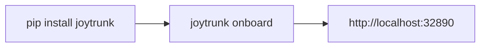
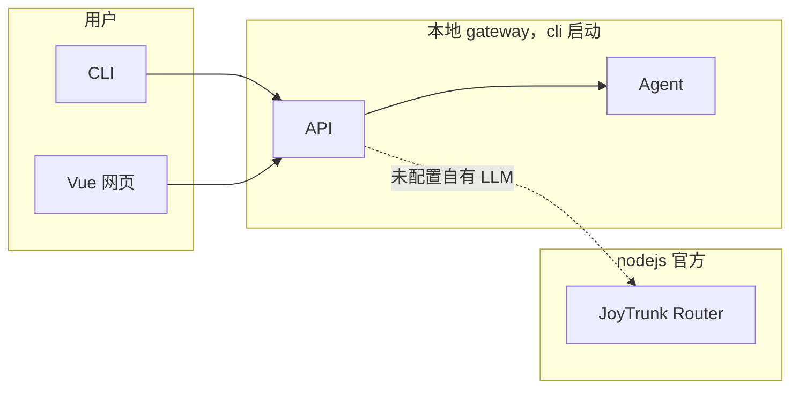

# JoyTrunk（喜象 Agent）— Agent 蓝图

> **给 Agent 的说明**：动手前先看 **§7 Agent 协作标注**，避免重复与冲突；工作期间更新该区状态。实现须带测试，**完成前**跑通测试。环境：**Windows + PowerShell**，conda 环境 `joytrunk`；命令与脚本一律用 **PowerShell 语法**。

---

## 1. 项目概述

- **项目名**：JoyTrunk。产品见 [product.md](product.md)。
- **一句话**：本地 7×24 多智能体员工；本机创建多名员工（Agent）、直接下达指令。**无需绑定负责人**：本机即用，gateway 首次请求自动创建本地上下文。
- **安装与使用**：`pip install joytrunk` → `joytrunk onboard` 初始化；本地管理 **http://localhost:32890**（默认 32890）。支持 **Linux 与 Windows**；开箱即用、本地单机不强制登录。

---

## 2. 技术栈与架构

- **独立产品**：**cli/**、**vue/**、**nodejs/** 三目录实现；**不依赖** nanobot 运行时代码（仅参考）。**双后端**：**本地管理后端**（cli 内，32890）供 CLI/Vue 使用；**JoyTrunk 官方后端**（nodejs）负责注册、IM、LLM Router、计费。
- **大模型**：未配置自有 LLM 时走 **JoyTrunk Router**（官方计费）；配置自有 API Key/Base URL/模型后直连用户 endpoint，不计费。仅 Router 用量计费。

- **cli**：`joytrunk` 入口；`joytrunk onboard` / **`joytrunk chat`**（TUI：员工列表、新建后直接对话）/ **`joytrunk employee`**（查看·新增·设置）/ `joytrunk gateway`（可选）/ `joytrunk status` / `joytrunk language` / `joytrunk docs`。chat、employee、status **不连 gateway**，直接读写 config。
- **vue**：官网前端；本地管理界面在 **cli/joytrunk/ui**，由 `joytrunk gateway` 提供。
- **nodejs**：官方后端（注册、IM、LLM Router、计费）。

---

## 3. 关键路径与约定

### 3.1 入口命令

- 子命令：`onboard`、`docs`、**`chat`**（TUI，从 config 读员工，末项「新建员工」）、**`employee`**（list/new/set，读写 config）、`gateway`、`status`、`language [zh|en]`。chat/employee 不依赖 gateway。

### 3.2 配置与工作区（统一约定）

- **根路径**：`~/.joytrunk`（Windows：`%USERPROFILE%\.joytrunk`）。实现用 `Path.home()` / `os.homedir()`，勿写死 `~` 或反斜杠。
- **全局 config**：`~/.joytrunk/config.json` **仅全局配置**（ownerId、gateway、agents.defaults、channels、providers、cli.locale），**无 employees 字段**。旧版 employees 数组首次加载时迁移到各员工目录 config 并写回。
- **员工**：每位员工作为**独立 agent**，配置在 **`~/.joytrunk/workspace/employees/<employee_id>/config.json`**（身份 + 可选 `agents`/`providers` 覆盖）。员工列表 = 扫描 `workspace/employees/` 各目录并读其 config.json。不用 store.json。
- **workspace**：`~/.joytrunk/workspace`；`workspace/employees/<id>/` 含该员工 config.json、memory/、skills/，模板（SOUL/AGENTS 等）从包内复制；`workspace/skills/`、`workspace/memory/` 为共享。合并规则：**全局 config 打底，员工 config 的 agents/providers 覆盖**；agent 用 `get_merged_config_for_employee(employee_id)`。
- **onboard**：创建根目录、config、workspace、skills、memory；员工目录在「创建员工」时由 CLI 或 gateway 创建。若 **cli 主目录**（包上一级，即仓库 `cli/`）存在有效 **.env**（如 OPENAI_API_KEY、JOYTRUNK_ROUTER_URL 等），提示是否导入到全局 config 的 providers.custom / providers.joytrunk；变量见 `cli/.env.example`。完成后可提示打开 32890。
- **gateway 与 CLI**：CLI 的 chat/employee/status 不连 gateway；对话时若用自有 LLM 则直连，用 Router 则经 gateway 或可访问 Router。

### 3.3 大模型、测试、发布、TUI

- **大模型/计费**：同 §2；无 customLLM/providers 即走 Router；API Key 建议服务端加密。
- **测试**：cli 用 `tests/` + pytest；vue/nodejs 见各 package.json。Windows 下 conda 环境 `joytrunk`，PowerShell：`cd cli; pytest -v`。交付前各子项目测试通过。
- **发布**：PyPI 包 `joytrunk`；本地管理默认 **http://localhost:32890**。
- **TUI**：**python-clack**（已移除 Textual）。↑↓ 移动、Enter 确定、空格多选（可选）。语言选择、员工选择/新建、对话循环在 `joytrunk/tui/clack_flows.py`（run_language_picker、run_chat_entry、run_chat_loop）。

---

## 4. 开发约定

- **员工生存法则**：系统提示/模板/技能中统一贯彻（product.md §8、§9）：不向非负责人泄露宿主机状态或敏感信息；仅可在脱敏前提下帮助他人。
- **术语**：负责人、员工、JoyTrunk 团队；**nanobot** 仅参考，不依赖、不调用。
- **CLI**：Python 实现、pip 分发；entry_points 注册 `joytrunk`；本地后端由 CLI 启动（如 Node 子进程），32890。**TUI 技术栈：python-clack**。
- **测试**：不强制先测或先实现；完成标准 = 功能 + 对应测试 + 测试命令全过。新功能须有对应测试。
- **终端**：文档与命令默认 **Windows + PowerShell**（路径、`$env:变量名`、续行反引号）；Linux 单独注明。产品需在 Linux 与 Windows 运行。
- **环境**（PowerShell）：`conda create -n joytrunk python=3.11 -y`；`conda activate joytrunk`；`cd cli; pip install -e ".[dev]"; joytrunk onboard`。多行可用 `;` 或反引号续行。

---

## 5. 多智能体协作（必读）

- **开始/结束**：在 **§5.2 Agent 协作标注** 新增或更新一条（谁、做什么、状态、备注）；结束或暂停时更新状态与交接点。
- **阅读**：着手开发前阅读该区，避免重复与冲突。

### 5.2 Agent 协作标注

| 时间 | Agent | 任务 | 状态 | 备注 |
| --- | --- | --- | --- | --- |
| 2025-02-27 | Cursor Agent | 配置统一 config.json、chat/employee 不连 gateway、每员工独立 config.json 覆盖全局 | 已完成 | config_store、gateway store 读写 config；员工扫描 workspace/employees/；agent.md 已更新。 |
| 2025-02-27 | Cursor Agent | cli/.env 与 onboard 导入 | 已完成 | paths.get_cli_root、env_loader、onboard 提示导入；.env.example、README、agent.md。 |
| 2025-02-27 | Cursor Agent | CLI 界面 python-clack、移除 Textual | 已完成 | clack_flows：language_picker、chat_entry、chat_loop；依赖仅 python-clack。 |
| 2025-02-27 | Cursor Agent | TUI 方案 §4.8、语言选择 TUI | 已完成 | ↑↓+Enter；run_language_picker。 |
| 更早 | — | 基础设施、后端/前端/通道/agent、chat/status、大模型与计费、测试、员工模板、自有 LLM 设置 | 已完成 | 见 git 历史或此前协作标注。 |
