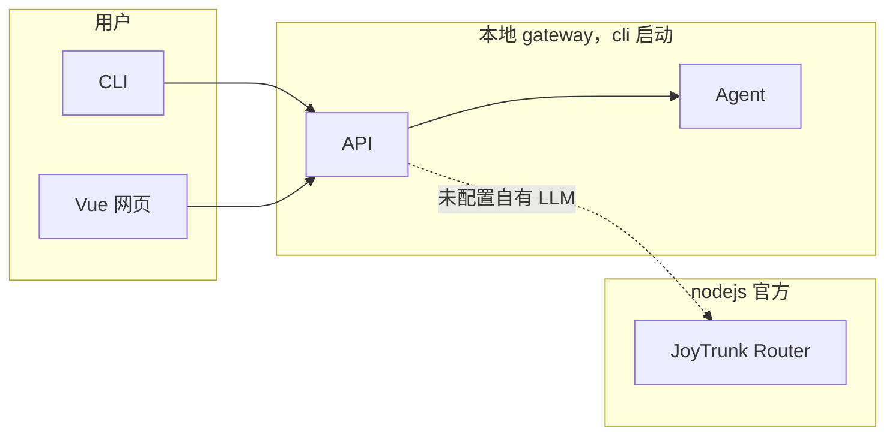
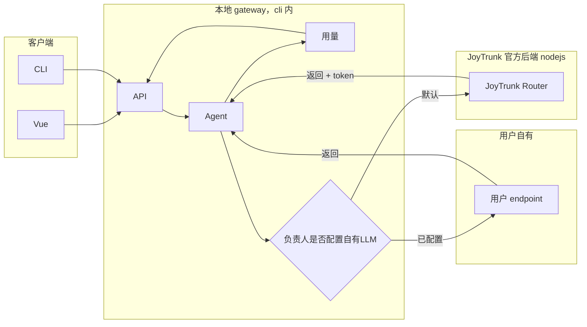

# JoyTrunk（喜象 Agent）— Agent 蓝图

> **给 Agent 的说明**：动手前先看 **§7 Agent 协作标注**，避免重复与冲突；工作期间更新该区状态。实现须带测试，**完成前**跑通测试。环境：**Windows + PowerShell**，conda 环境 `joytrunk`；命令与脚本一律用 **PowerShell 语法**。

---

## 1. 项目概述

- **项目名**：JoyTrunk。产品定义见 [product.md](product.md)。
- **一句话**：JoyTrunk 是一款部署在用户本地的、7×24 小时运行的多智能体员工；用户在本机创建多名员工（Agent），直接下达指令、接收结果，支持员工生存法则与可选社交能力。**无需「绑定负责人」**：本机即用，server 首次请求时自动创建本地上下文。
- **目标用户**：不熟悉 AI 技术但希望使用智能体的用户，开箱即用、无需复杂配置。
- **运行平台**：JoyTrunk **支持 Linux 与 Windows 双平台**；cli 与本地 gateway 可在两种系统上安装运行，配置与 workspace 路径按平台解析（见 §4.2）。
- **安装与发布**：用户可通过 **`pip install joytrunk`** 安装；安装后获得 `joytrunk` 命令行入口。使用 **`joytrunk onboard`** 初始化本地配置与工作区、配置员工；本地网页管理在 **http://localhost:32890**（默认端口 32890），用于管理员工、团队与设置。
- **默认即可用、无需登录**：用户安装并执行 onboard 后**默认处于可用状态**，无需注册或登录即可创建员工、与员工对话（CLI 或网页）。**登录/注册仅用于使用 JoyTrunk 自有即时通讯工具**时的身份绑定（如多端同步、官方 App 等）；本地单机使用不强制登录。

---

## 2. 技术栈与架构

JoyTrunk 是**独立产品**，由 **cli/**、**vue/**、**nodejs/** 三个目录完整实现，**不依赖、不包含** nanobot 作为运行时代码。nanobot 仅作**学习与模仿对象**，目标是在架构与体验上超越 nanobot。架构上采用**双后端**：**本地管理后端**由 **cli** 提供并启动，监听 32890，供本地 Vue 与 CLI 使用，其实现**归属 cli**（当前在 nodejs 中的对应逻辑将迁移到 cli）；**JoyTrunk 官方后端**为 **nodejs/** 目录，实现全平台注册用户、JoyTrunk 即时通讯服务、LLM Router 等云端/官方能力。JoyTrunk **支持 Linux 与 Windows**；cli 与本地 server 在两平台上均可运行。JoyTrunk 以 **PyPI 包** 形式发布，包名 **`joytrunk`**，支持 `pip install joytrunk`（Linux / Windows）。**CLI 入口** 由该 Python 包提供（`joytrunk`、`joytrunk onboard` 等）；本地管理界面（Vue + 本地 server API）需能由该包**启动并监听 32890 端口**（例如通过 `joytrunk server` 或在 onboard 时提示启动）。

- **cli/**：以 `joytrunk` 为入口命令，`joytrunk onboard` 初始化配置与工作区；**`joytrunk chat`** 默认进入**互动式 TUI**：显示本地员工列表（或「无员工」时引导新建），选择员工后进入对话，**新建员工后直接进入该员工对话下达指令**；作为「CLI 渠道」与员工对话；**内含并启动本地管理后端**（员工/团队 CRUD、本地 config/workspace、agent 与 32890 API）；**提供 `joytrunk docs`**，文档源位于 `joytrunk/docs`；可选 `joytrunk server`、`joytrunk status`、`joytrunk language`。**不要求用户「绑定负责人」**：server 首次请求时自动创建本地上下文，本机多员工即可用。
- **vue/**：**仅官网**前端（产品页、下载/文档/定价、手机验证码登录、云端 IM）。对接 **JoyTrunk 官方后端**（nodejs）。**本地管理界面**已迁入 **cli/joytrunk/ui**，由 `joytrunk server` 构建并随 32890 提供。
- **nodejs/**：**JoyTrunk 官方后端**：全平台注册用户、JoyTrunk 即时通讯后端、LLM Router、计费与用量等；本地未配置自有 LLM 时由该 Router 提供大模型能力。

### 大模型接入：默认 JoyTrunk Router，支持用户可选配置自有 LLM

- **默认**：未配置自有 LLM 时，大模型请求由**本地 gateway（cli）**转发至 **JoyTrunk 官方后端**的 **JoyTrunk Router**，用户无需配置任何 API Key；Router 返回 completion 及 token 数，官方后端做用量存储与计费。
- **可选**：负责人可在设置中配置自有大模型（API Key、Base URL、模型名）；配置后该负责人的 agent 请求由**本地 gateway**直连用户提供的 endpoint，不经过 JoyTrunk Router，不产生 JoyTrunk 计费；可选统计 token 仅用于前端展示。
- **计费**：仅对经 JoyTrunk Router 的用量计费；自有 LLM 用量不计费。

---

## 3. 关键路径与约定

### 3.1 入口命令

- 子命令：`onboard`、`docs`、**`chat`**（TUI，从 config 读员工，末项「新建员工」）、**`employee`**（list/new/set，读写 config）、`gateway`、`status`、`language [zh|en]`。chat/employee 不依赖 gateway。

| 产品需求来源 | 功能细化 |
| --- | --- |
| 安装与注册、开箱即用（product §6、product §1） | 提供 `joytrunk` 入口命令；`joytrunk onboard` 初始化本地配置与工作区（如 `~/.joytrunk`），创建/刷新配置文件、工作区目录、模板，交互简洁、无需复杂配置。 |
| 作为即时通讯渠道之一（product §5） | 作为「CLI 渠道」：**`joytrunk chat`** 默认进入**互动式 TUI**，显示本地员工列表（或无员工时引导新建）；选择员工后进入对话，**新建员工后直接进入该员工对话下达指令**；与**本地 server**（cli 内）通信。可选 `joytrunk chat <员工ID>` 指定员工，`--no-tui` 使用传统单行输入。**无需绑定负责人**：先执行 `joytrunk server` 启动本地服务即可。 |
| 后台运行与待命（product §6） | 可选子命令：`joytrunk server` 启动 **cli 内的本地管理后端**，使员工 7×24 待命；`joytrunk status` 查看运行状态、当前员工列表（需先启动 server）；`joytrunk language [zh|en]` 配置 CLI 界面语言。 |
| 配置与多端一致 | 配置与工作区路径、schema 与 **cli 内本地 gateway** 约定一致（如 `~/.joytrunk/config.json`、`~/.joytrunk/workspace`），便于 vue 或**本地 gateway** 共用同一套配置。 |

- **根路径**：`~/.joytrunk`（Windows：`%USERPROFILE%\.joytrunk`）。实现用 `Path.home()` / `os.homedir()`，勿写死 `~` 或反斜杠。
- **全局 config**：`~/.joytrunk/config.json` **仅全局配置**（ownerId、gateway、agents.defaults、channels、providers、cli.locale），**无 employees 字段**。旧版 employees 数组首次加载时迁移到各员工目录 config 并写回。
- **员工**：每位员工作为**独立 agent**，配置在 **`~/.joytrunk/workspace/employees/<employee_id>/config.json`**（身份 + 可选 `agents`/`providers` 覆盖）。员工列表 = 扫描 `workspace/employees/` 各目录并读其 config.json。不用 store.json。
- **workspace**：`~/.joytrunk/workspace`；`workspace/employees/<id>/` 含该员工 config.json、memory/、skills/，模板（SOUL/AGENTS 等）从包内复制；`workspace/skills/`、`workspace/memory/` 为共享。合并规则：**全局 config 打底，员工 config 的 agents/providers 覆盖**；agent 用 `get_merged_config_for_employee(employee_id)`。
- **onboard**：创建根目录、config、workspace、skills、memory；员工目录在「创建员工」时由 CLI 或 gateway 创建。若 **cli 主目录**（包上一级，即仓库 `cli/`）存在有效 **.env**（如 OPENAI_API_KEY、JOYTRUNK_ROUTER_URL 等），提示是否导入到全局 config 的 providers.custom / providers.joytrunk；变量见 `cli/.env.example`。完成后可提示打开 32890。
- **gateway 与 CLI**：CLI 的 chat/employee/status 不连 gateway；对话时若用自有 LLM 则直连，用 Router 则经 gateway 或可访问 Router。

### 3.3 大模型、测试、发布、TUI

- **大模型/计费**：同 §2；无 customLLM/providers 即走 Router；API Key 建议服务端加密。
- **测试**：cli 用 `tests/` + pytest；vue/nodejs 见各 package.json。Windows 下 conda 环境 `joytrunk`，PowerShell：`cd cli; pytest -v`。交付前各子项目测试通过。
- **发布**：PyPI 包 `joytrunk`；本地管理默认 **http://localhost:32890**。
- **TUI**：**python-clack**（已移除 Textual）。↑↓ 移动、Enter 确定、空格多选（可选）。语言选择、员工选择/新建、对话循环在 `joytrunk/tui/clack_flows.py`（run_language_picker、run_chat_entry、run_chat_loop）。

### 3.4 会话历史与发给大模型的消息

- **历史来源**：`load_history(employee_id, session_key)` 从 `workspace/employees/<id>/sessions/<session_key>.json` 读取该会话已落盘消息（user/assistant/tool）。CLI 对话的 session_key 为 `cli:direct`。
- **条数限制**：`MEMORY_WINDOW = 50`（`loop.py`）。历史超过 50 条时只取**最近 50 条**（`history[-50:]`），按条数截断、不按轮数。
- **消息拼接顺序**（`context.build_messages`）：**system**（人格/生存法则/长期记忆/技能） + **history**（上述最近 50 条） + **user（runtime）**（时间、channel、chat_id） + **user（当前用户输入）**。同一轮内若模型返回 tool_calls，会在内存中往 messages 后追加 assistant 与 tool 消息，再次请求大模型时带上整段 messages，不再重新读文件。
- **落盘**：每轮结束后 `append_turn(employee_id, session_key, messages, skip_count)` 将本轮的 runtime user、当前 user、assistant、tool 等追加进 session 文件；`skip_count = 1 + len(history)` 表示从「当前 turn 的第一条 user（runtime）」起算本轮。tool 消息的 content 超过 500 字会截断后写入（`session.TOOL_RESULT_MAX_CHARS`）。

- **cli**：`joytrunk onboard`、**cli 内本地管理后端**（员工/团队 CRUD、config/workspace、32890 API）、**`joytrunk chat` 互动式 TUI**（员工列表 / 新建后直接对话，无需绑定负责人）、可选 `joytrunk server`、`joytrunk status`、`joytrunk language`。
- **vue**：注册/登录、自有 IM 对话界面、创建并绑定至少一名员工、基础员工配置（人格/职责）；对接本地管理后端（32890），绑定账号时对接 JoyTrunk 官方后端。
- **nodejs（JoyTrunk 官方后端）**：注册用户、JoyTrunk 即时通讯后端、LLM Router、计费与用量；单通道（如先做 JoyTrunk 自有 IM 或与本地 gateway 协作）消息收发。

---

## 4. 开发约定

### 4.1 入口命令

- **入口命令**：`joytrunk` 由 **pip 安装的 Python 包** 提供（在 cli 项目中实现，通过 `pyproject.toml` 等 entry_points 注册）。
- **子命令**：`joytrunk onboard`（初始化配置与工作区，可引导用户打开本地管理页）、`joytrunk docs`（打开命令指南：默认官网，`--local` 本地查看，`--path` 打印文档目录）、**`joytrunk chat`**（默认 TUI：从 config.json 读取员工列表，最后一项为「新建员工」，选择后进入对话；不连接 server）、**`joytrunk employee`**（查看/新增/设置员工，均读写 config.json）、`joytrunk server`（启动本地管理后端，仅保留供网页/UI）、`joytrunk status`（从 config.json 读取员工列表）、`joytrunk language [zh|en]` 等。

### 4.2 配置与工作区路径

- **根路径**：JoyTrunk 本地根（单机对应本机所有员工）。在 **Linux/macOS** 下为 `~/.joytrunk`，在 **Windows** 下为 `%USERPROFILE%\.joytrunk`（PowerShell 中即 `$env:USERPROFILE\.joytrunk`）。实现时使用**平台无关**方式解析用户主目录（如 Node 的 `os.homedir()`、Python 的 `Path.home()`），避免写死 `~` 或反斜杠。**无需用户「绑定负责人」**：server 首次 API 请求时自动创建本地默认上下文并写入 config，CLI 与网页即可创建员工、对话。
- **配置文件**：**全局** `~/.joytrunk/config.json` **仅保留全局配置**（如 ownerId、gateway、agents.defaults、channels、providers、cli.locale 等），**不包含员工列表**。**每位员工作为独立 agent**，各自使用 **`~/.joytrunk/workspace/employees/<employee_id>/config.json`**，用于存放该员工的身份信息（id、ownerId、name、persona、role 等）及可选的 `agents`、`providers` 覆盖项（覆盖全局配置）。员工列表由扫描 `workspace/employees/` 下各目录并读取其 `config.json` 得到。不使用 store.json。schema 在 JoyTrunk 代码库内定义，cli 与本地 gateway 统一约定。
- **全局 config.json 结构**：`version`、`joytrunkRoot`、`ownerId`、`gateway`（`host`/`port`）、`agents.defaults`、`channels`、`providers`、`cli`。**无 employees 字段**。旧版若含 employees 数组，首次加载时会自动迁移到各员工目录的 config.json 并写回全局 config。
- **workspace 根**：`~/.joytrunk/workspace` 为本机工作区根目录。各员工目录下的 config.json 见 §4.3。

### 4.3 多员工下的 ~/.joytrunk/workspace 设定

本机可拥有多名员工（多 Agent），每名员工有独立人格、记忆与技能。workspace 需支持**多员工隔离**，同时保留本机级共享配置与可选共享资源。以下路径在 **Linux 与 Windows** 上含义相同；实现时使用路径拼接库（如 Node 的 `path.join`）以保证两平台路径分隔符正确。

- **多员工子目录**：`~/.joytrunk/workspace/employees/<employee_id>/`
  - `<employee_id>` 由 CLI 或 gateway 创建员工时分配（如 UUID）；**员工列表**由扫描该目录下子文件夹、并读取各子目录中的 **config.json** 得到（不存于全局 config）。
- **每员工子目录**（仿 nanobot 单 agent，创建员工时从 **JoyTrunk 包内/捆绑模板** 复制初始化）：
  - **每个员工都有一个 config.json**（路径：`~/.joytrunk/workspace/employees/<employee_id>/config.json`）：该文件即**该员工作为独立 agent 的配置**，包含（1）身份字段：`id`、`ownerId`、`name`、`persona`、`role`、`specialty`、`status`、`createdAt` 等；（2）可选覆盖：`agents`、`providers`，用于覆盖全局 config 的对应部分。合并规则：**全局 config 打底，员工 config 中的 `agents`、`providers` 覆盖全局**；agent 回复时通过 `get_merged_config_for_employee(employee_id)` 得到合并后的配置。创建员工时由 CLI 或 gateway 写入该文件并复制模板；gateway 提供 **GET/PATCH `/api/employees/:id/config`** 读写员工级覆盖。
  - **模板**：`SOUL.md`、`USER.md`、`AGENTS.md`、`TOOLS.md`、`HEARTBEAT.md`；模板仅存于 joytrunk 包内；创建员工时由 CLI 或 gateway 从捆绑模板复制到该员工目录。
  - **memory/**：该员工的私有记忆与历史；与团队共享 `workspace/memory/` 合并后参与上下文。
  - **skills/**：该员工私有技能；加载时先共享 `workspace/skills/` 再本目录，同名本目录覆盖。
  - 单员工能力与 nanobot 对齐：人格、记忆、指令等由上述模板与目录支撑；agent 回复时读取员工 SOUL/AGENTS 等构建上下文。
- **负责人级共享**：
  - **`~/.joytrunk/config.json`**：**仅全局配置**（通道、默认 LLM、gateway、ownerId 等），不包含员工列表。
  - `~/.joytrunk/workspace/memory/`（可选）：团队共享记忆；所有员工可见。
  - `~/.joytrunk/workspace/skills/`（可选）：团队共享技能；所有员工默认可见。
- **onboard 行为**：`joytrunk onboard` 创建 `~/.joytrunk`、`~/.joytrunk/workspace`、`workspace/skills`、`workspace/memory`；**员工目录**在「创建员工」时由 CLI 或 gateway 创建，并写入该员工的 config.json 及从 joytrunk 捆绑模板复制文件。
- **与本地 gateway 的对应**：全局 config 仅存 ownerId 等全局配置；**员工数据**来自各 `workspace/employees/<id>/config.json`，gateway 与 CLI 均通过扫描该目录及读取各 config.json 获取员工列表。CLI 的 chat、employee、status 不依赖 gateway；选择员工后对话时若使用 JoyTrunk Router 才需 gateway 或可访问 Router。

### 4.4 onboard

- 在 cli 内实现创建 config、workspace、**workspace/skills**、**workspace/memory**（不创建 workspace/templates）；模板仅存于 joytrunk 包内，员工子目录在**创建员工时**由**本地 gateway**从捆绑模板复制初始化。
- onboard 完成后可**提示用户**在浏览器打开 **http://localhost:32890** 进行员工配置与网页管理（若服务已启动或需先执行某子命令启动，在提示中说明）。
- **cli 目录下的 .env**：onboard 时若在 **cli 主目录**（joytrunk 包所在目录的上一级，即仓库中的 `cli/`，**非** workspace）发现有效的 `.env` 文件（至少包含一个可导入变量且值非空，如 `OPENAI_API_KEY`、`JOYTRUNK_ROUTER_URL` 等），会提示用户是否将其中 API Key 等配置导入到全局 `~/.joytrunk/config.json`，便于本地测试；导入写入 `providers.custom` 与 `providers.joytrunk`。变量说明见 `cli/.env.example`。
- 设计时可参考 nanobot、openclaw 的 onboard 交互与目录结构，但不调用其代码。

### 4.5 大模型接入与计费

- **默认**：负责人未配置自有 LLM 时，所有大模型请求由**本地 gateway（cli）**转发至 **JoyTrunk 官方后端**的 **JoyTrunk Router**，携带负责人/会话鉴权；Router 返回 completion 与 token 数，**官方后端（nodejs）**落库并**计费**（预付费扣余额或后付费记账）。
- **自有 LLM**：负责人已在设置中配置自有大模型（API Key、Base URL、模型名等）且有效时，该负责人的 agent 请求由**本地 gateway**直连用户 endpoint，**不经过 JoyTrunk Router**，不产生 JoyTrunk 计费；可选将 token 写入用量表（source=custom）仅用于展示。
- **计费范围**：仅对经 **JoyTrunk Router** 的用量（source=router）计费；自有 LLM 用量不计费。配置存储：默认无 `customLLM`/`providers` 即走 Router；API Key 建议存服务端加密，不落盘本地 config。

### 4.6 测试

- **测试目录与命令**：cli 使用 `tests/` 及 `pytest`（如 `pytest -v`）；vue 使用 Vitest 及 `npm run test`；nodejs 使用 Jest/Vitest 及 `npm test`。具体以各子项目 package.json 与 README 为准。
- **Windows 开发**：在 **conda 环境 `joytrunk`** 中运行 CLI 与测试；命令示例为 **PowerShell**（如 `conda activate joytrunk`；`cd cli; pytest -v`）。
- **合并或交付前**：运行各子项目测试，确保无失败。

### 4.7 发布与本地管理端口

- **发布**：以 **PyPI** 发布，包名 `joytrunk`；`pip install joytrunk` 后即可使用 `joytrunk`；支持 Linux 与 Windows。
- **本地网页管理**：默认在 **http://localhost:32890** 提供管理界面（员工、团队、设置等）；由 **CLI 启动的本地管理后端**（cli 内）监听 32890（或可配置端口，默认 32890）；文档与 onboard 提示中统一使用 32890。

### 4.8 TUI 操作方案（类 Claude Code / Open Code 的直观界面）

CLI 以**互动式 TUI** 为主，提供与 Claude Code、Open Code 类似的**列表选择 + 键盘操作**体验，避免依赖「输入一行再回车」的问答式交互。

- **设计目标**：选项以**上下列表**呈现；用户用**方向键移动**高亮、**回车确认**当前项；多选场景下可用**空格勾选/取消**、回车提交。界面简洁、操作可预期。
- **通用键位约定**：
  - **↑ / ↓（方向键）**：在列表中上/下移动高亮项。
  - **Enter（回车）**：确认当前高亮项（单选）或提交已选项（多选）。
  - **空格**：在多选列表中勾选/取消当前项（可选能力，按需实现）。
  - **Esc**：返回上一级或退出当前 TUI（如从对话界面返回员工列表）。
- **典型场景**：
  - **语言选择**（如 onboard 或 `joytrunk language` 无参数时）：展示「中文 (zh)」「English (en)」两项列表，↑↓ 移动、Enter 确定，无需用户输入字符。
  - **员工选择**（`joytrunk chat`）：展示员工列表，↑↓ 移动、Enter 进入与该员工的对话。
  - **主菜单**（可选）：无子命令时展示「与员工对话 / 启动 gateway / 状态 / 语言 / 文档 / 退出」等，↑↓ + Enter 进入对应功能。
- **实现**：CLI 互动式界面**技术栈已确定为 python-clack**，**已移除 Textual**。全部交互（语言选择、员工选择/新建、对话循环）均在 `joytrunk/tui/clack_flows.py` 中实现：`run_language_picker`（select）、`run_chat_entry`（select/text、新建员工）、`run_chat_loop`（text 输入、spinner 等待、log 输出回复与用量）。依赖仅含 **python-clack**（无 textual）。

---

## 5. 多智能体协作（必读）

- **已完成**：
  - product.md 定稿。
  - 技术路径确定（cli / vue / nodejs 独立实现，nanobot 仅作参考）。
  - agent.md 蓝图撰写（本文档）。
  - **CLI 互动式 TUI**：`joytrunk chat` 默认进入 TUI，显示本地员工列表（或无员工时引导新建）；新建员工后**直接进入该员工对话**下达指令；无需「绑定负责人」，先启动 `joytrunk server` 即可；**语言选择**（onboard 无语言配置时、`joytrunk language` 无参数时）采用 **↑↓ 移动、Enter 确定** 的 TUI（§4.8）；`joytrunk language [zh|en]` 仍支持命令行参数直接设置。
  - **TUI 技术栈**：CLI 互动式界面**全部使用 python-clack**，**已移除 Textual**。语言选择、员工选择/新建、对话循环均在 `joytrunk/tui/clack_flows.py`（`run_language_picker`、`run_chat_entry`、`run_chat_loop`）；cli 依赖仅含 `python-clack`（无 textual）。
- **待办**（按实现技术逻辑排序，供各 agent 按分工更新）：
  1. **基础设施**：创建 cli/、vue/、nodejs/ 目录与各自项目脚手架；pip 包与 CLI 骨架（pyproject.toml、entry_points、`joytrunk` / `joytrunk onboard` 占位）；实现 `joytrunk onboard` 创建 ~/.joytrunk、config、workspace；本地服务可在 32890 提供占位页或 API。 ✅ 已完成（见协作标注）
  2. **后端基础**：实现 **cli 内本地管理后端**（负责人/员工/团队 CRUD、config/workspace、32890 API）；**nodejs** 为 JoyTrunk 官方后端（注册用户、IM、LLM Router、计费与用量）。 ✅ 已完成
  3. **前端基础**：实现 vue 注册/登录、管理后台（员工、团队）在 localhost:32890 提供。 ✅ 已完成
  4. **通道与 agent**：单通道（Web 或 CLI）消息收发与 agent 调度、员工生存法则注入。 ✅ 已完成（占位 agent + POST /api/employees/:id/chat）
  5. **CLI 渠道**：实现 cli 作为 CLI 渠道与员工对话，可选 `joytrunk server`、`joytrunk status`。 ✅ 已完成（joytrunk chat、status 拉取员工列表）
  6. **大模型与计费**：实现双模式路由与 token 统计（**本地 gateway** 按负责人判断 Router vs 自有 LLM，解析并存储 token，仅 router 计费；自有 LLM 配置 CRUD API）；实现 **JoyTrunk 官方后端** Router 计费与前端用量/计费/自有 LLM 配置（官方后端用量/余额/账单查询 API；前端用量与计费页、自有 LLM 配置区块、「恢复默认 JoyTrunk」与用量区分展示）。 ✅ 后端占位已完成（GET /api/usage、PATCH/DELETE /api/config/custom-llm）；前端用量/计费页可后续迭代
  7. **测试**：为 cli/vue/nodejs 建立测试框架与首条测试；功能开发由上述测试约定约束（完成前测试齐全且通过）。 ✅ 已完成（nodejs: node --test；vue: vitest；cli: pytest 已有 paths/onboard 测试）

### 5.2 Agent 协作标注

| 时间 | Agent | 任务 | 状态 | 备注 |
| --- | --- | --- | --- | --- |
| 2025-02-26 | Cursor Agent | **实现架构拆分**：cli 内本地 server、nodejs 仅官方后端 | 已完成 | cli/joytrunk/gateway/：Node 本地管理后端（server.js + lib/），`joytrunk server` 从包内启动并 npm install 若需；nodejs/ 改为占位（GET /api/health），删除 lib/ 与旧 server；gateway 测试迁至 cli/joytrunk/gateway/tests/。Vue 仍对接 32890。 |
| 2025-02-26 | Cursor Agent | **架构拆分**：本地管理后端归属 cli 并由 CLI 启动，nodejs 为 JoyTrunk 官方后端（注册用户、IM、LLM Router） | 已完成 | 仅修改 agent.md：§2 双后端、§3 CLI/Vue/Node 职责、§4 约定、§5 待办、§6 技术选型、§7.2 协作标注。 |
| 2025-02-26 | Cursor Agent | 基础设施：cli/vue/nodejs 脚手架、joytrunk CLI、onboard、32890 占位 | 已完成 | cli: pyproject.toml + joytrunk 包 + onboard；nodejs: Express 32890 + /api/health；vue: Vite+Vue3 占位。CLI 测试需在已安装 typer/pytest 环境中运行。 |
| 2025-02-26 | Cursor Agent | 待办 2–7：后端、前端、通道与 agent、CLI 渠道、大模型与计费、测试 | 已完成 | nodejs: 账号/员工/团队 CRUD、config/workspace、chat API、生存法则、customLLM/usage 占位。vue: 注册/登录、团队与员工管理、与员工对话。cli: joytrunk chat、status。测试：node --test、vitest、pytest。 |
| 2025-02-26 | Cursor Agent | 员工模板（仿 nanobot）、默认免登录、登录仅 IM、单员工能力 | 已完成 | cli: 包内 templates（SOUL/USER/AGENTS/TOOLS/HEARTBEAT、memory）；onboard 写入 workspace/templates。nodejs: 创建员工时复制 templates；getOwnerId 自动创建默认负责人。vue: 默认 dashboard，绑定账号可选。agent: 回复时读取员工 SOUL/AGENTS。agent.md 已更新。 |
| 2025-02-26 | Cursor Agent | 自有 LLM 接入 + 前端设置（用量、自有 LLM 配置、恢复默认） | 已完成 | nodejs: agent.reply 支持 OpenAI 兼容 API，system 从 SOUL/AGENTS/MEMORY 构建；chat 返回 usage。vue: 设置区块展示用量、API Key/Base URL/模型、保存与恢复默认。 |
| 2025-02-27 | Cursor Agent | **CLI 无需绑定负责人、多智能体、TUI 与新建后直接对话** | 已完成 | 产品表述改为「本地多智能体 · 创建员工、直接下达指令」；`joytrunk chat` 默认进入入口 TUI（员工列表 / 无员工时新建）；新建员工后直接 push ChatScreen 下达指令；status/chat 提示改为「请先启动 joytrunk server」；api_client 增加 ensure_owner_via_gateway、create_employee；agent.md 已同步更新。 |
| 2025-02-27 | Cursor Agent | **TUI 操作方案（§4.8）与语言选择 TUI** | 已完成 | agent.md 新增 §4.8 TUI 操作方案（类 Claude Code/Open Code：↑↓ 移动、Enter 确定、空格多选）；实现 LanguagePickerApp（joytrunk/tui/language_picker.py），onboard 无语言配置时及 `joytrunk language` 无参数时进入 TUI 选择 zh/en；测试更新为 mock LanguagePickerApp。 |
| 2025-02-27 | Cursor Agent | **使用 python-clack 实现 TUI（language / chat 入口）** | 已完成 | 依赖增加 python-clack；新增 joytrunk/tui/clack_flows.py（run_language_picker、run_chat_entry）；onboard / language / chat 无参数时走 clack 流程（select/text）；选员工后仍启动 Textual ChatTuiApp。§4.8、§5、§6 已更新；测试 test_clack_flows、test_cli_onboard 已适配。 |
| 2025-02-27 | Cursor Agent | **CLI 界面技术栈确定为 python-clack，移除 Textual** | 已完成 | 全部 TUI 改为 python-clack：新增 run_chat_loop（text/spinner/log 对话循环）；删除 chat_app.py、entry_app.py、language_picker.py、panel_style.py；移除 textual 依赖；删除 test_tui_entry.py。§4.8、§5、§6 已更新为「技术栈已确定，仅 python-clack」。 |
| 2025-02-27 | Cursor Agent | **配置统一 config.json、chat/employee 不连 gateway、gateway 仅保留** | 已完成 | 所有配置（含员工、ownerId）放入 config.json，移除 store.json。chat：从 config 读员工，TUI 最后一项「新建员工」，不连 gateway。employee：list/new/set 均读写 config。gateway store 改为读写 config.json。新增 config_store.py、employee set；docs 与 agent.md 已更新。 |
