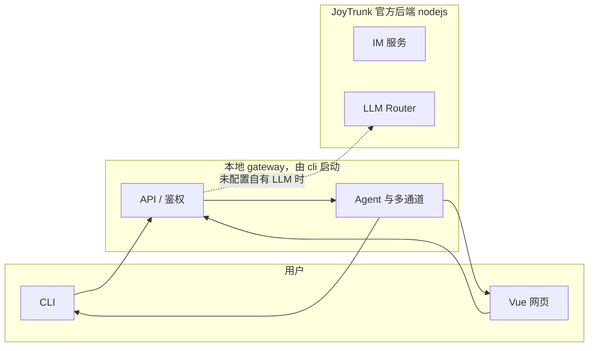
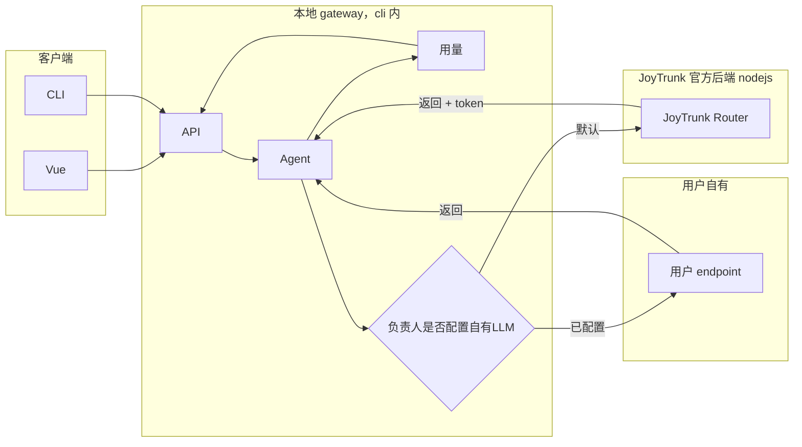

# JoyTrunk（喜象 Agent）— Agent 蓝图

> **给 Agent 的说明**：在着手任何开发或修改前，请先阅读本文档的「Agent 协作标注」区，了解当前是否有其他 agent 正在相关工作，避免重复劳动与冲突。工作期间请主动在该区更新你的任务与状态，离开或完成后及时更新，便于其他 agent 接手。实现或修改功能时，**按最高效方式做好测试**（可先写测试再实现，也可先实现再补测）；**完成前**须运行测试并确保全部通过。用户环境为 **Windows**，终端默认 **PowerShell**；**开发与文档统一使用 conda 环境 `joytrunk`**；给出或执行终端命令、脚本时，**一律使用 PowerShell 语法**，勿默认使用 Linux/bash 语法。

---

## 1. 项目概述

- **项目名**：JoyTrunk。产品定义见 [product.md](product.md)。
- **一句话**：JoyTrunk 是一款部署在用户本地的、7×24 小时运行的智能体员工；负责人通过即时通讯与员工交互完成日常工作，支持多员工、员工生存法则与可选社交能力。
- **目标用户**：不熟悉 AI 技术但希望使用智能体的用户，开箱即用、无需复杂配置。
- **运行平台**：JoyTrunk **支持 Linux 与 Windows 双平台**；cli 与本地 gateway 可在两种系统上安装运行，配置与 workspace 路径按平台解析（见 §4.2）。
- **安装与发布**：用户可通过 **`pip install joytrunk`** 安装；安装后获得 `joytrunk` 命令行入口。使用 **`joytrunk onboard`** 初始化本地配置与工作区、配置员工；本地网页管理在 **http://localhost:32890**（默认端口 32890），用于管理员工、团队与设置。
- **默认即可用、无需登录**：用户安装并执行 onboard 后**默认处于可用状态**，无需注册或登录即可创建员工、与员工对话（CLI 或网页）。**登录/注册仅用于使用 JoyTrunk 自有即时通讯工具**时的身份绑定（如多端同步、官方 App 等）；本地单机使用不强制登录。

---

## 2. 技术栈与架构

JoyTrunk 是**独立产品**，由 **cli/**、**vue/**、**nodejs/** 三个目录完整实现，**不依赖、不包含** nanobot 作为运行时代码。nanobot 仅作**学习与模仿对象**，目标是在架构与体验上超越 nanobot。架构上采用**双后端**：**本地管理后端**由 **cli** 提供并启动，监听 32890，供本地 Vue 与 CLI 使用，其实现**归属 cli**（当前在 nodejs 中的对应逻辑将迁移到 cli）；**JoyTrunk 官方后端**为 **nodejs/** 目录，实现全平台注册用户、JoyTrunk 即时通讯服务、LLM Router 等云端/官方能力。JoyTrunk **支持 Linux 与 Windows**；cli 与本地 gateway 在两平台上均可运行。JoyTrunk 以 **PyPI 包** 形式发布，包名 **`joytrunk`**，支持 `pip install joytrunk`（Linux / Windows）。**CLI 入口** 由该 Python 包提供（`joytrunk`、`joytrunk onboard` 等）；本地管理界面（Vue + 本地 gateway API）需能由该包**启动并监听 32890 端口**（例如通过 `joytrunk serve`、`joytrunk gateway` 或在 onboard 时提示启动）。


上述流程：用户安装 → onboard 初始化 → 在 32890 端口进行网页管理（32890 由 cli 启动的本地管理后端提供）。



- **cli/**：以 `joytrunk` 为入口命令，`joytrunk onboard` 初始化配置与工作区；作为「CLI 渠道」与员工对话；**内含并启动本地管理后端**（负责人/员工/团队 CRUD、本地 config/workspace、agent 与 32890 API）；**提供 `joytrunk docs`**，文档源位于 `joytrunk/docs`，可构建部署为官网命令指南；可选 `joytrunk gateway`、`joytrunk status`。
- **vue/**：**仅官网**前端（产品页、下载/文档/定价、手机验证码登录、云端 IM）。对接 **JoyTrunk 官方后端**（nodejs）。**本地管理界面**已迁入 **cli/joytrunk/ui**，由 `joytrunk gateway` 构建并随 32890 提供。
- **nodejs/**：**JoyTrunk 官方后端**：全平台注册用户、JoyTrunk 即时通讯后端、LLM Router、计费与用量等；本地未配置自有 LLM 时由该 Router 提供大模型能力。

### 大模型接入：默认 JoyTrunk Router，支持用户可选配置自有 LLM

- **默认**：未配置自有 LLM 时，大模型请求由**本地 gateway（cli）**转发至 **JoyTrunk 官方后端**的 **JoyTrunk Router**，用户无需配置任何 API Key；Router 返回 completion 及 token 数，官方后端做用量存储与计费。
- **可选**：负责人可在设置中配置自有大模型（API Key、Base URL、模型名）；配置后该负责人的 agent 请求由**本地 gateway**直连用户提供的 endpoint，不经过 JoyTrunk Router，不产生 JoyTrunk 计费；可选统计 token 仅用于前端展示。
- **计费**：仅对经 JoyTrunk Router 的用量计费；自有 LLM 用量不计费。



---

## 3. cli / vue / nodejs 功能细化（满足产品需求）

以下按 [product.md](product.md) 的需求对三端功能细化，便于按模块分工实现。本节表格中「product §X」指 product.md 的节号。

### 3.1 CLI（本地命令行，兼作一种 IM 渠道）

| 产品需求来源 | 功能细化 |
| --- | --- |
| 安装与注册、开箱即用（product §6、product §1） | 提供 `joytrunk` 入口命令；`joytrunk onboard` 初始化本地配置与工作区（如 `~/.joytrunk`），创建/刷新配置文件、工作区目录、模板，交互简洁、无需复杂配置。 |
| 作为即时通讯渠道之一（product §5） | 作为「CLI 渠道」：用户通过终端与指定员工对话，下达任务、接收结果；需与**本地 gateway**（cli 内）通信，支持选择当前负责人、当前员工、会话。 |
| 后台运行与待命（product §6） | 可选子命令：`joytrunk gateway` 启动 **cli 内的本地管理后端**，使员工 7×24 待命；与**本地 agent / 本地后端**协同；`joytrunk status` 查看运行状态、已绑定渠道、当前员工列表等。 |
| 配置与多端一致 | 配置与工作区路径、schema 与 **cli 内本地 gateway** 约定一致（如 `~/.joytrunk/config.json`、`~/.joytrunk/workspace`），便于 vue 或**本地 gateway** 共用同一套配置。 |

### 3.2 Vue（前端网页：JoyTrunk 自有 IM + 管理后台）

| 产品需求来源 | 功能细化 |
| --- | --- |
| 安装与注册、扫码注册（product §6） | **默认即可用**：打开网页即进入管理后台，无需登录；可创建员工、与员工对话。**登录/注册**为可选，仅用于「绑定账号」以使用 JoyTrunk 自有即时通讯（网页/App 等）；绑定账号后可在设置中补充其他登录与联系方式。 |
| 自有即时通讯（product §5） | 即时通讯客户端：对接**本地管理后端**（由 cli 启动，默认 32890）；绑定 JoyTrunk 账号时与 **JoyTrunk 官方后端**（nodejs）通信。会话列表、与某位员工的对话界面、发送消息、接收员工回复（富文本/文件等）；支持多员工切换，即「与 JoyTrunk 团队联系」的默认方式之一。 |
| 创建员工并成为负责人、多员工（product §2、§6、§7） | 管理后台：创建 JoyTrunk 员工（名称、人格、职责、专长等），创建即绑定为当前用户为负责人；员工列表、编辑/停用员工；团队视图：负责人 + 多名员工形成 JoyTrunk 团队。 |
| 多员工与人格分化（product §4） | 员工配置 UI：为人格、职责、专长、业务模块、工作重心等设值；不同员工不同配置，像管理真人员工一样管理智能体团队。 |
| 绑定多种交互方式（product §5） | 设置/渠道管理：绑定或解绑第三方渠道（飞书、QQ、Telegram 等），查看 CLI 是否已连接；可选展示「默认通过微信小程序与 App」的入口（若后续有小程序/App）。 |
| 观察与试用他人员工（product §3） | （可选，MVP 后可做）浏览其他负责人的公开员工、试用体验，便于选择或设计自己的团队。 |
| **用量与收费** | 默认展示「当前使用 JoyTrunk 智能体服务」与用量/计费入口；提供「使用自己的大模型（可选）」配置（API Key、Base URL、模型），保存后走自有 LLM，提供「恢复默认使用 JoyTrunk」；用量页区分 Router 计费用量与自有 LLM 用量（仅展示、注明不计费）；预付费展示余额/充值/扣费记录，后付费展示本期用量与账单。 |

### 3.3 Node.js（JoyTrunk 官方后端）

| 产品需求来源 | 功能细化 |
| --- | --- |
| 账号与注册（product §6） | **全平台注册用户**：默认即可用（本地首次请求时由**本地 gateway** 自动创建默认负责人）；**注册/登录** API 用于「绑定 JoyTrunk 即时通讯」时的身份；鉴权与权限（仅负责人可管理自己的员工与团队）。 |
| JoyTrunk 即时通讯后端 | **JoyTrunk 即时通讯后端**：消息、会话、多端同步；与 vue 或移动端通信（WebSocket/HTTP）；与**本地 gateway** 协作（如会话、用户绑定）。 |
| LLM Router（product §5、§6） | **LLM Router**：接收来自**本地 gateway** 或客户端的推理请求（当负责人未配置自有 LLM 时），返回 completion 与 token；用量存储与**计费**由官方后端落库。可选：本地 gateway 将「未配置自有 LLM」的请求转发至官方 Router。 |
| 计费与用量 | 仅对经 JoyTrunk Router 的用量计费；预付费扣余额或后付费记账；提供用量/余额/账单查询 API；自有 LLM 配置 CRUD（敏感字段脱敏）。 |
| 扩展（可选） | 若产品上需要官方侧也存团队元数据，可与本地 gateway 同步或单独维护；负责人/员工/团队 CRUD、本地 config/workspace 归属 **cli 内本地 gateway**。 |

### 3.4 MVP 优先级建议（对应 product §7）

- **cli**：`joytrunk onboard`、**cli 内本地管理后端**（负责人/员工/团队 CRUD、config/workspace、32890 API）、`joytrunk` 作为 CLI 渠道与员工对话，可选 `joytrunk gateway` 与 `joytrunk status`。
- **vue**：注册/登录、自有 IM 对话界面、创建并绑定至少一名员工、基础员工配置（人格/职责）；对接本地管理后端（32890），绑定账号时对接 JoyTrunk 官方后端。
- **nodejs（JoyTrunk 官方后端）**：注册用户、JoyTrunk 即时通讯后端、LLM Router、计费与用量；单通道（如先做 JoyTrunk 自有 IM 或与本地 gateway 协作）消息收发。

---

## 4. 关键路径与约定

### 4.1 入口命令

- **入口命令**：`joytrunk` 由 **pip 安装的 Python 包** 提供（在 cli 项目中实现，通过 `pyproject.toml` 等 entry_points 注册）。
- **子命令**：`joytrunk onboard`（初始化配置与工作区，可引导用户打开本地管理页）、`joytrunk docs`（打开命令指南：默认官网，`--local` 本地查看，`--path` 打印文档目录）、可选 `joytrunk agent`、`joytrunk gateway`、`joytrunk status` 等。启动本地服务的子命令（如 `joytrunk serve` 或 `joytrunk gateway`）启动的是 **cli 内的本地管理后端**，默认绑定 **localhost:32890**，用于提供网页管理界面与 API。

### 4.2 配置与工作区路径

- **根路径**：JoyTrunk 本地根（单机通常对应一名负责人）。在 **Linux/macOS** 下为 `~/.joytrunk`，在 **Windows** 下为 `%USERPROFILE%\.joytrunk`（PowerShell 中即 `$env:USERPROFILE\.joytrunk`）。实现时使用**平台无关**方式解析用户主目录（如 Node 的 `os.homedir()`、Python 的 `Path.home()`），避免写死 `~` 或反斜杠。
- **配置文件**：`~/.joytrunk/config.json`（通用写法）；Windows 下等价于 `%USERPROFILE%\.joytrunk\config.json`。schema 在 JoyTrunk 代码库内定义，**cli 与本地 gateway** 统一约定（若本地 gateway 仍用 Node，可写「与 cli 包内 Node 实现一致」）。
- **config.json 结构（仿 nanobot）**：统一采用 `version`、`joytrunkRoot`、`ownerId`、`gateway`（`host`/`port`）、`agents.defaults`（`defaultEmployeeId`、`model`、`maxTokens`、`temperature`）、`channels`（`cli`/`web`/`feishu`/`telegram`/`qq` 等）、`providers`（`joytrunk`、`custom`：`apiKey`/`apiBase`/`model`）。旧版字段自动迁移：`gatewayPort` → `gateway.port`，`customLLM` → `providers.custom`，`baseUrl` → `apiBase`，`defaultEmployeeId` → `agents.defaults.defaultEmployeeId`。cli 的 `config_schema.py` 与**本地 gateway** 的 configSchema 保持一致；读写时均经迁移函数保证兼容。
- **workspace 根**：`~/.joytrunk/workspace` 为该负责人的工作区根目录；Windows 下等价于 `%USERPROFILE%\.joytrunk\workspace`。主 config 可被各员工目录下的 `config.json` 覆盖，见 §4.3 每员工子目录中的 config.json。

### 4.3 多员工下的 ~/.joytrunk/workspace 设定

一名负责人可拥有多名员工，每名员工有独立人格、记忆与技能。workspace 需支持**多员工隔离**，同时保留负责人级共享配置与可选共享资源。以下路径在 **Linux 与 Windows** 上含义相同；实现时使用路径拼接库（如 Node 的 `path.join`）以保证两平台路径分隔符正确。

- **多员工子目录**：`~/.joytrunk/workspace/employees/<employee_id>/`
  - `<employee_id>` 与 **本地 gateway** 分配/存储一致（如 UUID），由**本地 gateway**（cli 内）分配，cli/vue 通过配置或 API 获取。
- **每员工子目录**（仿 nanobot 单 agent，创建员工时从 **JoyTrunk 包内/捆绑模板** 复制初始化）：
  - **模板**：`SOUL.md`（员工人格）、`USER.md`（负责人/用户画像）、`AGENTS.md`（员工指令与生存法则）、`TOOLS.md`（工具说明）、`HEARTBEAT.md`（周期任务）；模板**仅存在于 joytrunk 包内**（**cli 包内 `joytrunk/templates`** 与 **cli 内本地 gateway 的捆绑 templates**），**workspace 下不设 templates**；创建员工时由**本地 gateway**从捆绑模板复制到该员工目录。
  - **memory/**：该员工的**私有**记忆与历史（`MEMORY.md`、`HISTORY.md` 等），**不与其他员工共享**。构建上下文时与**团队共享记忆**（`workspace/memory/`）合并：先拼共享再拼本员工，共同组成长期记忆。
  - **skills/**：该员工**私有**技能或对共享技能的同名覆盖。加载时先加载共享 `workspace/skills/`，再加载本目录；同名时本目录覆盖共享。
  - **config.json**（可选，覆盖主配置）：路径为 `~/.joytrunk/workspace/employees/<employee_id>/config.json`。可覆盖主 config 的 `agents.defaults`（如 `model`、`maxTokens`、`temperature`）与 `providers.custom`（该员工专用自有 LLM）。合并规则：主配置打底，员工 config 中出现的键覆盖主配置；仅支持 `agents`、`providers` 两个顶层键。创建员工时由**本地 gateway**写入空 `{}`；通过 **GET/PATCH `/api/employees/:id/config`** 读写；agent 回复时使用合并后的配置决定模型与 endpoint。
  - 单员工能力与 nanobot 对齐：人格、记忆、指令等由上述模板与目录支撑；agent 回复时读取员工 SOUL/AGENTS 等构建上下文。
- **负责人级共享**：
  - `~/.joytrunk/config.json`：全局配置（含通道、LLM、当前负责人/默认员工等）。
  - `~/.joytrunk/workspace/memory/`（可选）：**团队共享记忆**，如 `MEMORY.md`、`HISTORY.md` 等；所有员工可见。构建上下文时先拼**共享记忆**再拼**员工私有记忆**（`workspace/employees/<id>/memory/`），二者共同组成该员工的长期记忆。
  - `~/.joytrunk/workspace/skills/`（可选）：**团队共享技能**，所有员工默认可见。技能为子目录（如 `<name>/SKILL.md`）。加载时先加载共享 skills，再加载员工私有 `workspace/employees/<id>/skills/`；**同名技能时员工覆盖共享**。
  - **模板仅存于 joytrunk**：SOUL、USER、AGENTS、TOOLS、HEARTBEAT、memory 等模板只存在于 joytrunk CLI 包（`joytrunk/templates`）与 **cli 内本地 gateway 的捆绑目录**；**创建员工时**由**本地 gateway**从该捆绑模板复制到 `workspace/employees/<employee_id>/`，workspace 下不设 `templates/`。
- **onboard 行为**：`joytrunk onboard` 创建 `~/.joytrunk`、`~/.joytrunk/workspace`、`workspace/skills`、`workspace/memory`（**不创建** `workspace/templates`）；**员工目录**在「创建员工」时由**本地 gateway**创建并从 joytrunk 捆绑模板复制，避免未使用的员工占满磁盘。
- **与本地 gateway 的对应**：**本地 gateway**（cli 内）存储负责人、员工、团队元数据（含 employee_id）；agent 调度通过 employee_id 解析路径 `~/.joytrunk/workspace/employees/<employee_id>/`。cli 与 vue 选择当前员工后，向**本地 gateway**传 employee_id，以便读写该员工 workspace 与加载对应记忆/人格。

### 4.4 onboard

- 在 cli 内实现创建 config、workspace、**workspace/skills**、**workspace/memory**（不创建 workspace/templates）；模板仅存于 joytrunk 包内，员工子目录在**创建员工时**由**本地 gateway**从捆绑模板复制初始化。
- onboard 完成后可**提示用户**在浏览器打开 **http://localhost:32890** 进行员工配置与网页管理（若服务已启动或需先执行某子命令启动，在提示中说明）。
- 设计时可参考 nanobot、openclaw 的 onboard 交互与目录结构，但不调用其代码。

### 4.5 大模型接入与计费

- **默认**：负责人未配置自有 LLM 时，所有大模型请求由**本地 gateway（cli）**转发至 **JoyTrunk 官方后端**的 **JoyTrunk Router**，携带负责人/会话鉴权；Router 返回 completion 与 token 数，**官方后端（nodejs）**落库并**计费**（预付费扣余额或后付费记账）。
- **自有 LLM**：负责人已在设置中配置自有大模型（API Key、Base URL、模型名等）且有效时，该负责人的 agent 请求由**本地 gateway**直连用户 endpoint，**不经过 JoyTrunk Router**，不产生 JoyTrunk 计费；可选将 token 写入用量表（source=custom）仅用于展示。
- **计费范围**：仅对经 **JoyTrunk Router** 的用量（source=router）计费；自有 LLM 用量不计费。配置存储：默认无 `customLLM`/`providers` 即走 Router；API Key 建议存服务端加密，不落盘本地 config。

### 4.6 测试

- **测试目录与命令**：cli 使用 `tests/` 及 `pytest`（如 `pytest -v`）；vue 使用 Vitest 及 `npm run test`；nodejs 使用 Jest/Vitest 及 `npm test`。具体以各子项目 package.json 与 README 为准。
- **Windows 开发**：在 **conda 环境 `joytrunk`** 中运行 CLI 与测试；命令示例为 **PowerShell**（如 `conda activate joytrunk`；`cd cli; pytest -v`）。
- **合并或交付前**：运行各子项目测试，确保无失败。

### 4.7 发布与本地管理端口

- **发布**：以 **PyPI** 发布，包名 `joytrunk`；`pip install joytrunk` 后即可使用 `joytrunk`；支持 Linux 与 Windows。
- **本地网页管理**：默认在 **http://localhost:32890** 提供管理界面（员工、团队、设置等）；由 **CLI 启动的本地管理后端**（cli 内）监听 32890（或可配置端口，默认 32890）；文档与 onboard 提示中统一使用 32890。

---

## 5. 当前进度

- **已完成**：
  - product.md 定稿。
  - 技术路径确定（cli / vue / nodejs 独立实现，nanobot 仅作参考）。
  - agent.md 蓝图撰写（本文档）。
- **待办**（按实现技术逻辑排序，供各 agent 按分工更新）：
  1. **基础设施**：创建 cli/、vue/、nodejs/ 目录与各自项目脚手架；pip 包与 CLI 骨架（pyproject.toml、entry_points、`joytrunk` / `joytrunk onboard` 占位）；实现 `joytrunk onboard` 创建 ~/.joytrunk、config、workspace；本地服务可在 32890 提供占位页或 API。 ✅ 已完成（见协作标注）
  2. **后端基础**：实现 **cli 内本地管理后端**（负责人/员工/团队 CRUD、config/workspace、32890 API）；**nodejs** 为 JoyTrunk 官方后端（注册用户、IM、LLM Router、计费与用量）。 ✅ 已完成
  3. **前端基础**：实现 vue 注册/登录、管理后台（员工、团队）在 localhost:32890 提供。 ✅ 已完成
  4. **通道与 agent**：单通道（Web 或 CLI）消息收发与 agent 调度、员工生存法则注入。 ✅ 已完成（占位 agent + POST /api/employees/:id/chat）
  5. **CLI 渠道**：实现 cli 作为 CLI 渠道与员工对话，可选 `joytrunk gateway`、`joytrunk status`。 ✅ 已完成（joytrunk chat、status 拉取员工列表）
  6. **大模型与计费**：实现双模式路由与 token 统计（**本地 gateway** 按负责人判断 Router vs 自有 LLM，解析并存储 token，仅 router 计费；自有 LLM 配置 CRUD API）；实现 **JoyTrunk 官方后端** Router 计费与前端用量/计费/自有 LLM 配置（官方后端用量/余额/账单查询 API；前端用量与计费页、自有 LLM 配置区块、「恢复默认 JoyTrunk」与用量区分展示）。 ✅ 后端占位已完成（GET /api/usage、PATCH/DELETE /api/config/custom-llm）；前端用量/计费页可后续迭代
  7. **测试**：为 cli/vue/nodejs 建立测试框架与首条测试；功能开发由上述测试约定约束（完成前测试齐全且通过）。 ✅ 已完成（nodejs: node --test；vue: vitest；cli: pytest 已有 paths/onboard 测试）

---

## 6. 开发约定

- **员工生存法则**：在系统提示词、模板、技能中统一贯彻（见 [product.md](product.md) §8、§9）：不得向任何非负责人泄露负责人宿主机工作状态或敏感信息；仅可在个人隐私脱敏前提下帮助他人。
- **术语统一**：文档与代码中统一使用「负责人」「员工」「JoyTrunk 团队」等术语。
- **nanobot**：本仓库内现有 nanobot 代码仅作**参考与学习**，JoyTrunk 的实现不依赖、不调用 nanobot；目标是在架构与体验上超越 nanobot。
- **CLI 技术选型**：`joytrunk` CLI 以 **Python** 实现，以满足 **pip 分发**；包结构需包含 `joytrunk` 控制台入口（如 `pyproject.toml` 的 entry_points）。由 Python 包**启动** cli 内的本地后端（如 Node 子进程或 Python HTTP 服务），绑定 32890；**nodejs/** 目录用于 JoyTrunk 官方后端（注册用户、IM、LLM Router），与本地 32890 解耦。
- **测试约定**：不强制测试与实现的先后顺序；根据任务选择最高效方式（如接口清晰时先测后实现，探索/UI 时先实现后补测）。完成标准：功能实现 + 对应测试存在 + 运行子项目测试命令全部通过。cli/vue/nodejs 各子项目须具备可运行的测试套件，并在项目内文档中写明测试命令（如 `npm test`）。单元测试覆盖核心逻辑与 API；关键流程建议有集成或 e2e；不强制覆盖率，但新功能须有对应测试。
- **终端与命令示例**：文档与命令示例默认面向 **Windows + PowerShell**；路径、环境变量、多行命令与脚本均按 PowerShell 书写（如换行续行用反引号 `` ` ``，环境变量用 `$env:变量名`）；针对 Linux/macOS 时单独注明。新写或修订的说明与 Agent 生成的命令应以 PowerShell 为准。JoyTrunk **产品** 需在 **Linux 与 Windows** 上均可运行；实现时注意路径解析、换行符、可选 shell 调用的跨平台差异。若文档面向 Linux 用户，可注明「Linux/macOS 下请使用 bash 及 `~/.joytrunk`」。
- **开发环境（Windows）**：统一使用 **conda 环境 `joytrunk`**。创建与激活示例（PowerShell）：
  ```powershell
  conda create -n joytrunk python=3.11 -y
  conda activate joytrunk
  cd cli; pip install -e ".[dev]"; joytrunk onboard
  ```
  多行命令在 PowerShell 中可用分号 `;` 连接，或换行续行用反引号 `` ` ``。环境变量示例：`$env:USERPROFILE\.joytrunk`、`$env:PORT = "32890"`。

---

## 7. 多智能体协作（必读）

### 7.1 使用规范

- **开始工作时**：在下方「Agent 协作标注」区新增或更新一条标注，写明：**谁**（Agent 标识/会话）、**在做什么**（任务/模块/文件）、**状态**（进行中 / 阻塞 / 待复核）、**可选备注**（依赖、提醒其他 agent 的事项）。
- **结束或暂停时**：更新该条状态，并简要说明结果或交接注意点，便于其他 agent 接手。
- 任何 agent 在着手某项开发或修改前，请先阅读本区，避免重复劳动与冲突；工作期间主动维护本区，离开或完成后及时更新。

### 7.2 Agent 协作标注

| 时间 | Agent/会话 | 任务 | 状态 | 备注 |
| --- | --- | --- | --- | --- |
| 2025-02-26 | Cursor Agent | **实现架构拆分**：cli 内本地 gateway、nodejs 仅官方后端 | 已完成 | cli/joytrunk/gateway/：Node 本地管理后端（server.js + lib/），`joytrunk gateway` 从包内启动并 npm install 若需；nodejs/ 改为占位（GET /api/health），删除 lib/ 与旧 server；gateway 测试迁至 cli/joytrunk/gateway/tests/。Vue 仍对接 32890。 |
| 2025-02-26 | Cursor Agent | **架构拆分**：本地管理后端归属 cli 并由 CLI 启动，nodejs 为 JoyTrunk 官方后端（注册用户、IM、LLM Router） | 已完成 | 仅修改 agent.md：§2 双后端、§3 CLI/Vue/Node 职责、§4 约定、§5 待办、§6 技术选型、§7.2 协作标注。 |
| 2025-02-26 | Cursor Agent | 基础设施：cli/vue/nodejs 脚手架、joytrunk CLI、onboard、32890 占位 | 已完成 | cli: pyproject.toml + joytrunk 包 + onboard；nodejs: Express 32890 + /api/health；vue: Vite+Vue3 占位。CLI 测试需在已安装 typer/pytest 环境中运行。 |
| 2025-02-26 | Cursor Agent | 待办 2–7：后端、前端、通道与 agent、CLI 渠道、大模型与计费、测试 | 已完成 | nodejs: 账号/员工/团队 CRUD、config/workspace、chat API、生存法则、customLLM/usage 占位。vue: 注册/登录、团队与员工管理、与员工对话。cli: joytrunk chat、status。测试：node --test、vitest、pytest。 |
| 2025-02-26 | Cursor Agent | 员工模板（仿 nanobot）、默认免登录、登录仅 IM、单员工能力 | 已完成 | cli: 包内 templates（SOUL/USER/AGENTS/TOOLS/HEARTBEAT、memory）；onboard 写入 workspace/templates。nodejs: 创建员工时复制 templates；getOwnerId 自动创建默认负责人。vue: 默认 dashboard，绑定账号可选。agent: 回复时读取员工 SOUL/AGENTS。agent.md 已更新。 |
| 2025-02-26 | Cursor Agent | 自有 LLM 接入 + 前端设置（用量、自有 LLM 配置、恢复默认） | 已完成 | nodejs: agent.reply 支持 OpenAI 兼容 API，system 从 SOUL/AGENTS/MEMORY 构建；chat 返回 usage。vue: 设置区块展示用量、API Key/Base URL/模型、保存与恢复默认。 |
